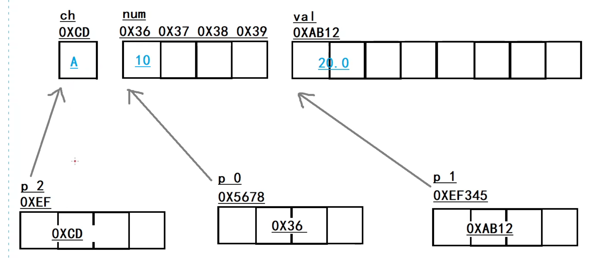
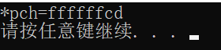

# C、C++指针再总结（pointer）

作为21天算法计划的第一章进行，指针有至关重要的作用，通过练习和听课不断提升自己，才是最终的王道。

## 一、指针的概念

- 每一种数据类型都有其指针形态，指针变量有自己的类型
- 指针变量存储的是地址（即变量在内存空间中的地址），存储的不是内存的值
- 指针变量有自己的类型，一般指针变量有8个字节

## 二、四要素

1. 指针本身的类型
2. 指针指向的类型
3. 指针本身的内存
4. 指针所指向的内存

## 三、运算符

- *运算符 定义指针表示定义的是一个指针，并且是一个指针自身的类型组成部分，其他的时候表示解引用（取出内容，通过内存编号，读取内存中的值）
- &运算符 取首地址符号，取出首地址

## 四、指针的定义和赋值（见代码）

```c++
float *p;

```

## 五、指针的内存探究

先看之后的代码，再看总结

```C++
#include<stdio.h>
#include<stdlib.h>
int main(void){
    int num=10;
    int *p_0=#
    printf("sizeof(num):%d \n",sizeof(num));
    printf("sizeof(p_0):%d \n",sizeof(p_0));
    double val=20.0;
    double*p_1=&val;
    //我们可以看到这里的打印p_1和打印p_0的大小都为8，可以大胆进行猜测，
    //不同的编译器对指针的处理的结果是不一样的，可以看到字节数是不一样的对比老师上课的内容
    printf("sizeof(val):%d \n",sizeof(val));
    printf("sizeof(p_1):%d \n",sizeof(p_1));
    char ch=0;
    char *p_2=&ch;
    printf("sizeof(ch):%d \n",sizeof(ch));
    printf("sizeof(p_2):%d \n",sizeof(p_2));
    system("pause");
}
```

总结：

1.变量在内存中所占的字节数

所有的指针，不论类型，在内存中所占的字节数都是一样的，

且对于不同的编译器不同，这里的原因应该是不同的编译器分配的虚拟内存空间不同，指针的大小不同，4个字节或者是8个字节，同时对于不同的操作系统也不同

0---FFFFFFFF

0---FFFF



2.指针本身的内存 以及指针指向的内存

指针本身的内存：4个字节  （指针变量只需要存储指向的变量的首地址）

指向的内存：指向的不同类型有不同的字节数

思考：这里也就大概知道了 指针存储首地址，那么其实是根据类型进行移位的，也就是说，如果我们创建的是一个结构体，那么它向后移位的时候，

那么向后移位的大小也肯定是结构体的大小。

那么我们可以做一些骚操作，也就是比如说我们现在用一个int类型变量，然后它是4个字节，那么如何让它指向中间呢，我们只需要找一个short类型的指针，然后给其赋值，然后向后进行移位，这样就可以指向中间的位置了

## 六、访问指针指向的空间

```cpp
printf("%d",*p_0);
```

## 七、指针的偏移

指针的偏移是不会改变指针的指向的：

    指针没有被赋值

这里同样的我们会进行一些非常规操作，去探究计算机底层的现象，看下面的代码

```cpp
#include<stdio.h>
#include<stdlib.h>
/**
 * 指针的偏移
 */
int main(void){
    int num=0x12ab34cd;
    int *p=\#
    char *pch=(char*)p;
    printf("*pch=%x\n",*pch);
    system("pause");
    return 0;
}
```

我们可以看到运行结果如下



我使用的是X86机型，这里默认的是小端存储，我们的num为12 ab 34 cd，则在机器中存储的为cd 34 ab 12，而我们使用的char类型在x86中存储为顺序存储，那我们此时读出的结果也就是cd，顺序读出了结果，所以显示的是FFFFFFCD，则我们这里开始使用指针偏移，则看如下的代码

```cpp
#include<stdio.h>
#include<stdlib.h>
/**
 * 指针的偏移
 */
int main(void){
    int num=0x12ab34cd;
    int *p=\&num\;
    char *pch=(char*)p;
    printf("*pch=%x\n",*pch);
    printf("*(pch+1)=%x\n",*(pch+1));
    system("pause");
    return 0;
}
```

这里我们肯定的运行结果为34，也就是我们取到了第二个字节，当然我们可以用指针访问到越界的地方，也就是*(pch+4)，这里可以进行到系统进行格式化的地方，在vs中为1100进行格式化，这里可以看到底层的内存的原理，还是十分的神奇的。

## 八、指针的运算

不同于指针的偏移，指针的加减会改变指针的指向，指针会被赋值，指针本身改变，指针指向的类型是旁边的位置。

探究：大小端存储模式
