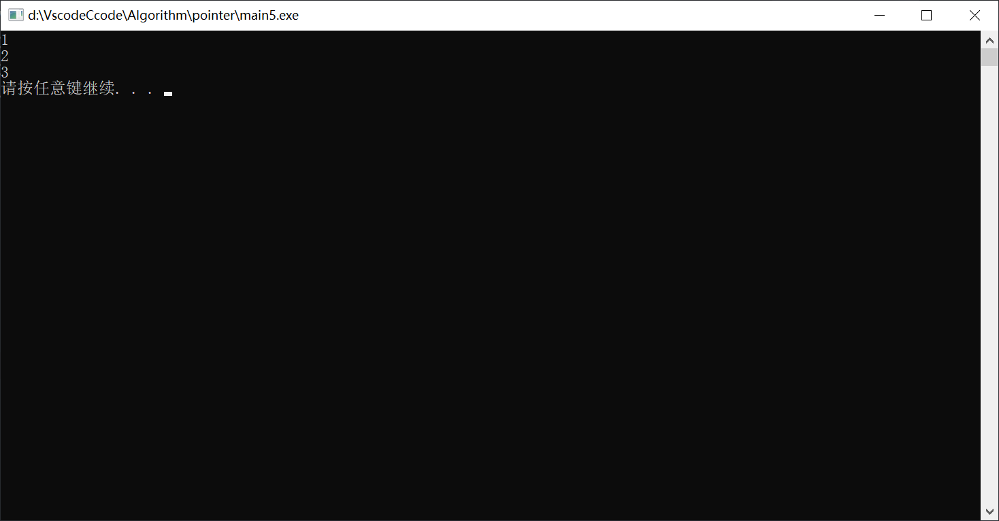

# C、C++指针再总结二

这一节开始讲解内存区域划分以及动态开辟内存等内容

## 一、内存的区域的划分

常量区，栈区，堆区，静态全局区（，代码区）

1.代码区：存代码

2.常量区：存常量

3.静态全局区：静态变量，全局变量 静态变量声明使用的关键字static

对于上面的静态变量，全局变量有如下代码：

```cpp
#include<stdio.h>
#include<stdlib.h>
int b;//全局变量
static int d;//静态全局变量
int main(void){
    int a;//局部变量
    static int c;//静态局部变量
    printf("%d\n",a);
    printf("%d\n",b);
    printf("%d\n",c);
    printf("%d\n",d);
    system("pause");
    return 0;  
}
```

在vs2013的运行中，会发现局部变量a没有赋值，会报错，而其他变量没有这样的问题，都是已经进行了赋值，这里也可以知道除了a之外，静态变量，全局变量都存在于静态全局区，同时会自动进行初始化，而局部变量会有一个随机数然后填入其中，一般情况会报错

```cpp
#include<stdio.h>
#include<stdlib.h>
/**
 * 全局变量：
 *  生命周期：程序开始到结束
 *  作用域：当前项目  当前项目可以具有别的文件
 */
int b;//全局变量


/**
 * 静态全局变量：
 *  生命周期：程序开始到结束
 *  作用域：当前文件 注意是当前文件
 */ 
static int d;//静态全局变量
int main(void){
    /**
     * 局部变量：
     *  生命周期：当前语句块
     *  作用域：当前语句块 （也就是大括号以内）
     */
    int a;//局部变量
  
    /**
     * 静态局部变量：
     *  生命周期：程序开始到结束
     *  作用域：当前语句块
     */
    static int c;//静态局部变量
    printf("%d\n",a);
    printf("%d\n",b);
    printf("%d\n",c);
    printf("%d\n",d);
    system("pause");
    return 0;  
}
```

当然我们可以使用static变量的性质完成一些非常规操作：

```cpp
#include<stdio.h>
#include<stdlib.h>
void fun(){
    static int s=0;
    s++;
    printf("%d\n",s);
}
int main(void){
    fun();
    fun();
    fun();
    system("pause");
    return 0;
}
```

我们可以看到输出的结果为



这里发现程序保存了static这个变量，并一直留在内存当中，当我们重复调用时，程序碰到静态变量会在全局静态区中查找同名称的变量，如果有相同的名称，则会对查找到的这个文件进行操作，则会完成当前的操作

4.栈区：普通局部变量，当函数执行完毕时，程序会释放内存空间，然后释放调用的变量

5.堆区：由程序员手动申请，手动释放，归还内存

## 二、void*指针

```cpp
#include<stdio.h>
#include<stdlib.h>
int main(){
    void* p_0=NULL;
    p_0=(void*)0x1234;
    printf("p_0:%x",p_0);
    // p_0++;  这里会发现void*的指针不能自增 同样的这个指针不能进行运算
    int num=10;
    int *p_1=NULL;
    p_1=#
    int *p_2=(int*)0Xcd00;
    p_0=p_1; //这里可以进行赋值
    printf("p_2:%x",p_2);
    p_2++; //这里会增加int的大小也就是4
    printf("p_2:%x",p_2);
    // printf("p_0:%d\n",*p_0); 这里也会发现不能取出其中的内容
    //这样接下来我们体验使用void*

}
/**
 * void*指针:
 *  不能进行运算和偏移
 *  不可以取出内容
 * 
 *  可以进行赋值
 *  可以接收任何类型的指针而不需要强制转换  -->可以作为一个中间变量负责指针之间的传递
 *  
 */
```

void*类型的指针作用总结如上

## 三、动态开辟内存

简单开辟内存：

1. 申请->使用->释放->置空（安全性考虑）
2. 关键函数：

   malloc(字节总数)

   calloc(单个类型的字节数，空间个数)

   返回都为void*类型的指针
3. 释放关键函数:

   free(地址) //从当前地址开始向后释放到我们申请的内存的最后
4. 注意事项：

   如果不释放申请的内存会发生内存泄漏。

   不置空：野指针

下面的代码进行了简单的操作

```cpp
#include<stdio.h>
#include<stdlib.h>
int main(void){
    //申请
    double *p=(double *)malloc(8);
    //使用
    *p=3.14;
    printf("%lf\n",*p);
    //释放
    free(p);
    //置空
    system("pause");
    return 0;  
}
```

当然我们malloc里面的申请应该使用sizeof(double)*n这样的操作这样的操作来解决，然后我们后面也可以使用calloc进行申请

```cpp
    //申请
    double *p1=(double*)calloc(sizeof(double),1);
    //使用
    *p1=3.14;
    printf("%lf\n",*p1);
    //释放
    free(p1);
    //置空
    p1=NULL;
```

当然我们可以申请连续的内存空间进行操作

```cpp
    //申请十个double类型大小的内存
    //1.申请
    double *p2=(double *)malloc(sizeof(double)*10);
    //2.使用
    for (size_t i = 0; i < 10; i++)
    {
        p2[i]=10+i;
        printf("%lf\n",p2[i]);
        printf("%lf\n",*(p2+i));//这里两种写法是等效的
    }
    //3.释放
    free(p2);
    //4.置空
    p2=NULL;
```

当然calloc也是同样的用法，为了避免越界的问题里面的n一般用一个变量进行代表，极大的提高了安全性

## 四、利用动态开辟内存模拟一个二维数组

```cpp
#include<stdio.h>
#include<stdlib.h>
int main(void){
    //我们如何申请一个类似二维数组的结构
    //这样就实现了分配二维数组的内容
    int len=3;
    int row=4;
    int **pp=(int **)calloc(sizeof(int*),row);
    for (size_t i = 0; i < row; i++)
    {
        pp[i]=(int *)calloc(sizeof(int),len);
    }
    //访问
    for (size_t i = 0; i <row; i++)
    {
        for (size_t j = 0; j <len; j++)
        {
            //当然这里也可以使用偏移调用，当然这里还是十分的复杂
            pp[i][j]=10*i+j;
            printf("%d\n",pp[i][j]);
        }
    }
  
    for (size_t i = 0; i < row; i++)
    {
        free(pp[i]);//释放每一行的内容
        pp[i]=NULL;
    }
    free(pp);//释放这里的内容
    pp=NULL;
    system("pause");
    return 0;
}
```

这里是分配二维数组的内容，需要注意的是，由于行列是两个变量，所以我们需要注意的是，在循环过程中不要选择错误的变量，这样很容易出现越界的问题，导致程序出现差错，甚至容易被攻击

## 五、给动态分配形成的数组重新分配内存

如果我们不利用realloc函数，我们用之前的函数，我们的第一个想法是用一个变量先存储扩容之前的值，然后对p进行calloc，再将temp指向的值赋值给p，然后就可以解决掉这样的问题，下面是简单的代码实现

```cpp
#include<stdio.h>
#include<stdlib.h>
int main(void){
    int len=5;
    //首次分配内存
    int *p=(int *)calloc(sizeof(int ),len);
    int *temp=p;
    int num=0;
    //当前的下标
    int i=0;

    //重复输入
    while (scanf("%d",&num),num!=-1)
    {
        if(i>=len){
            len+=5;
            p=(int *)calloc(sizeof(int),len);
            for(int j=0;j<len;j++){
                p[j]=temp[j];
            }
            free(temp);//先释放之前的结果
            temp=p;
        }
        temp[i++]=num;
    }
  
    for(int i=0;i<len;i++){
        printf("%-3d",p[i]);
    }
    free(p);
    system("pause");
    p=NULL;
  
    return 0;
}
```

上面的操作，我想起来go语言中，切片操作中，如果空间大小不够的话，那么会指向一个新的空间，感觉跟这里的很像，可能在设计上，go语言也考虑到了重新分配的问题。

如果我们利用realloc函数，这样我们进行一下操作

```cpp
#include<stdio.h>
#include<stdlib.h>
int main(void){
    int len=5;
    //首次分配内存
    int *p=(int *)calloc(sizeof(int ),len);
    int num=0;
    //当前的下标
    int i=0;

    //重复输入
    while (scanf("%d",&num),num!=-1)
    {
        if(i>=len){
            len+=5;
            p=(int*)realloc(p,sizeof(int)*len);
        }
        p[i++]=num;
    }
    printf("%d",len);
    for(int i=0;i<len;i++){
        printf("%-3d",p[i]);
    }
    free(p);
    system("pause");
    p=NULL;
  
    return 0;
}
```
