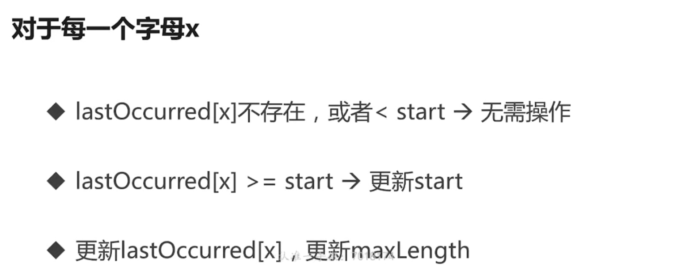

# 2.Go语言的内置容器(3) Map

1.map的定义


```go
m := map[string]string{
   "name":   "ccmouse",
   "course": "golang",
}
m2 := make(map[string]int) //m2=empty map
fmt.Println(m, m2)

var m3 map[string]int //m3==nil
fmt.Println(m, m2, m3)
```

2.map的遍历

```go
fmt.Println("Traversing map")
for k, v := range m {
   fmt.Println(k, v)
}
```

仍然是利用迭代器进行，当然也可以只取值其中之一

这里的map为hashmap，会随机进行输出

遍历过程是无序的，这样如果我们需要排序之后输出，那我们可以将key先存入一个slice，然后先对slice排序，最后输出结果

3.获取特定键值对的值

```go
fmt.Println("Getting values")
courseName := m["course"]
fmt.Println(courseName)
```

若键值对不存在，则会打印一个空串

```go
causeName, ok := m["cause"]
fmt.Println(causeName, ok)
```

ok变量用于标志当前的值是否存在，则我们可以进行如下操作

```go
if causeName, ok := m["cause"]; ok {
   fmt.Println(causeName)
} else {
   fmt.Println("key does not exist")
}
```

4.删除map中的元素

```go
//删除map中的元素
delete(m, "name")
```

5.结构体类型也可以作为key和value


6.例题：

**※寻找最长不含有重复字符的子串**

思路是当前这样的结果



这里使用的算法

```go
func lenthOfNonRepeatingSubStr(s string) int {
   lastOccured := make(map[byte]int)
   start := 0
   maxLength := 0
   for i, ch := range []byte(s) { //第一个数值为index 第二个数值为其字符
      lastI, ok := lastOccured[ch]
      if ok && lastI >= start {
         start = lastOccured[ch] + 1
      }
      if i-start+1 > maxLength {
         maxLength = i - start + 1
      }
      lastOccured[ch] = i
   }
   return maxLength
}
```

总结：总结下来的思路，即用一个指针先不断向后遍历数组，一个指针用于指向start，即字符串开始的位置，然后不断经过调整，让start指向不重复字符子串的开头，然后计算不重复子串的最大长度，然后不断替换，最终得到结果。