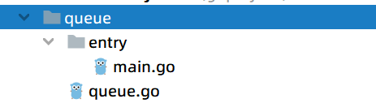

# **※扩充已有类型**

## 1.go语言不存在继承和多态，那我们如何对某一个包进行继承和扩展呢？

如何扩充系统类型或者别人的类型

```go
type myTreeNode struct {
   node *Treenode.TreeNode
}
```

仍然利用我们上面的实例，我们有如下结果

```go
func (myNode *myTreeNode) postOrder() {
   if myNode == nil || myNode.node == nil { //如果此时是空的node
      return
   }
   node := myTreeNode{myNode.node.Left}
   node.postOrder()
   treeNode := myTreeNode{myNode.node.Right}
   treeNode.postOrder()
   myNode.node.Print()
}
```

我们这里遇到了问题，我们需要用一个node去承接这个变量，因为我们开始定义的是一个指针接收者，而我们使用myTreenode定义的值是一个值传递，而不是指针，则这里我们需要拿新的变量去承接，然后实现递归的调用

上述方法是利用组合的方式进行拓展

## 2.利用封装实现一个队列

项目结构：



项目中文件：

queue.go

```go
package queue

type Queue []int

func (q *Queue) Push(v int) {
   *q = append(*q, v)
}

func (q *Queue) Pop() int {
   head := (*q)[0]
   *q = (*q)[1:]
   return head
}
func (q *Queue) IsEmpty() bool {
   return len(*q) == 0
}
```

main.go

```go
package main

import (
   "awesomeProject/queue"
   "fmt"
)

//这里很简单的实现了队列
func main() {
   q := queue.Queue{1}

   q.Push(2)
   q.Push(3)
   fmt.Println(q.Pop())
   fmt.Println(q.Pop())
   fmt.Println(q.IsEmpty())
   fmt.Println(q.Pop())
   fmt.Println(q.IsEmpty())
}
```

但是我们要注意，在进行这一系列操作之后，q也不再是原本的东西了，因为我们传递的是一个指针，当进行扩容时，会重新分配一个位置然后进行承接，这里使用的也就是定义别名的方法，将一个slice定义为一个新的类型名