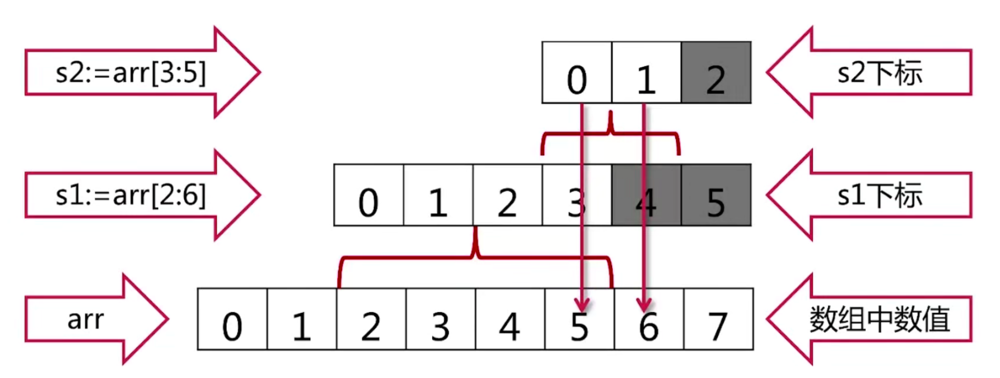
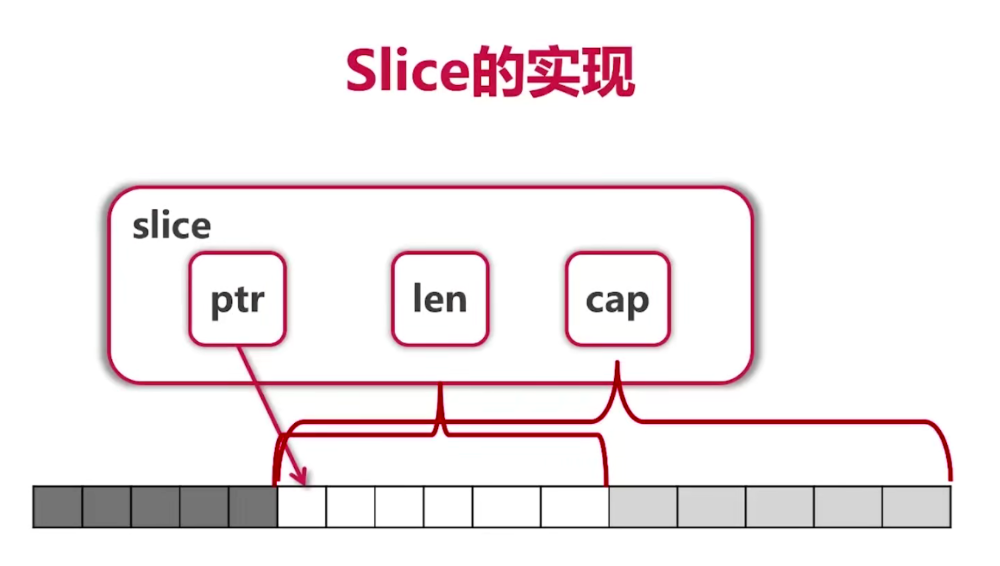
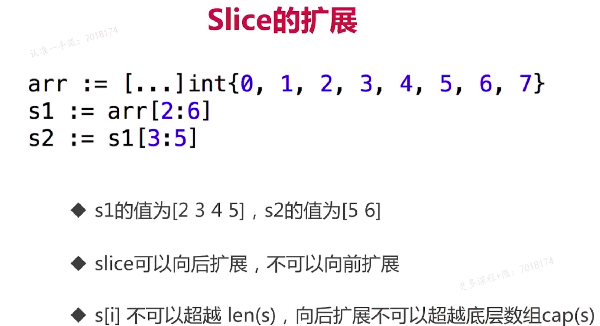
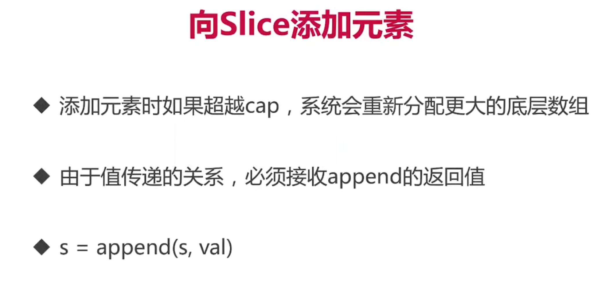
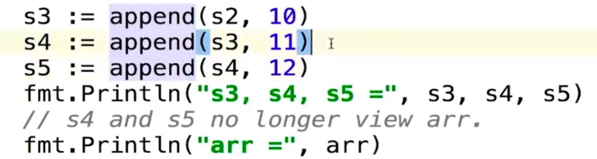
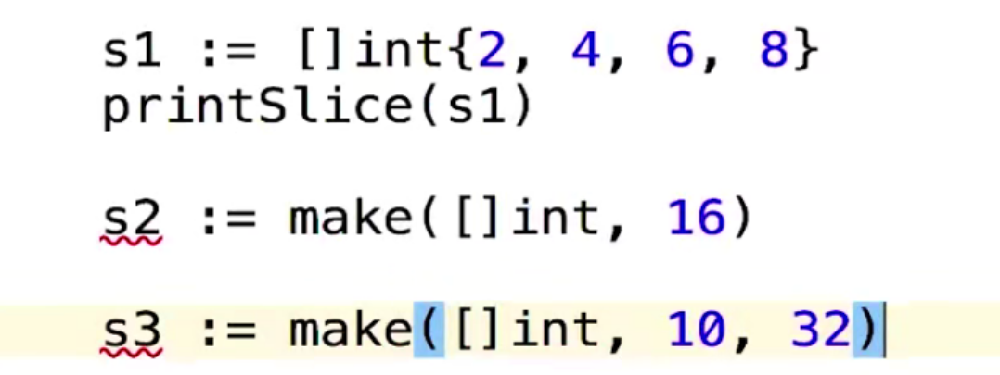

# Go语言的内置容器(2) 切片

## 一、基础知识

由于使用数组十分的不方便，Go语言使用切片进行各种操作来替代数组，方便执行

```go
//创建切片
arr := [...]int{0, 1, 2, 3, 4, 5, 6, 7}
s := arr[2:6]
fmt.Println("arr[2:6]", s)
```

这里采用的是左开右闭的区间

```go
arr := [...]int{0, 1, 2, 3, 4, 5, 6, 7}
s := arr[2:6]
fmt.Println("arr[2:6]", s) //[2 3 4 5]
fmt.Println("arr[:6]", arr[6])  //6 
fmt.Println("arr[2:]", arr[2:]) //[2 3 4 5 6 7]   
fmt.Println("arr[:]", arr[:]) //[0 1 2 3 4 5 6 7]
```

再看下面一段代码的运行结果

```go
package main

import "fmt"

func updateSlice(s []int) { //这里如果不加长度，则标识一个切片
   s[0] = 100
}
func main() {

   arr := [...]int{0, 1, 2, 3, 4, 5, 6, 7}
   s := arr[2:6]
   fmt.Println("arr[2:6]", s)
   fmt.Println("arr[:6]", arr[6])
   s1 := arr[2:]
   fmt.Println("s1=", s1)
   s2 := arr[:]
   fmt.Println("s2=", s2)
   fmt.Println("arr[2:]", arr[2:])
   fmt.Println("arr[:]", arr[:])
   updateSlice(s1)
   updateSlice(s2)
   fmt.Println("After updateSlice(s1)", s1)
   fmt.Println("After updateSlice(s2)", s2)

}
```

运行结果如下

```go
arr[2:6] [2 3 4 5]
arr[:6] 6                                  
s1= [2 3 4 5 6 7]                          
s2= [0 1 2 3 4 5 6 7]                      
arr[2:] [2 3 4 5 6 7]                      
arr[:] [0 1 2 3 4 5 6 7]                   
After updateSlice(s1) [100 3 4 5 6 7]      
After updateSlice(s2) [100 1 100 3 4 5 6 7]
```

可以看到这里其实本质上可以认为slice为一个引用传递，然后同时可以修改原数组内部的值，需要注意的是，在函数调用数组的时候，需要加其长度，因为其为值传递，而利用切片时则不需要传递，由于其使用的是引用传递。则在更多情况下**如果需要修改数组中的值，我们更多的使用的是slice**，这样就可以更好的解决问题

再看下面的对Slice再次进行Slice

```go
s2 = s2[2:4]
fmt.Println("Reslice:", s2)
```

在上面的结果下，我们可以再次进行切片，这样可以实现Reslice操作

再看下面一段代码，可以看到Slice的高级操作

```go
fmt.Println("Extending slice")
arr[0], arr[2] = 0, 2
s1 = arr[2:6]
s2 = s1[3:5]
fmt.Println("s1=", s1)
fmt.Println("s2=", s2)
```

这里叫做拓展切片

对于以上代码，应该会出现以下的结果



也就是由于是引用调用，其中存储的也就是地址，然后通过地址向后迭代，可以查询到后面的数值，但是当s1确定之后，就不能取得后面的值，只可以通过一个新的变量s2取出后面的元素，也就是说，切片对后面的元素有记忆，而对前面的元素没有。

slice的实现



也就是超过cap的话就不能进行拓展



这样我们也就可以实现当前的操作流程，当然我们也可以通过函数得到切片其中各个变量的值，如下

```go
fmt.Printf("s1=%v,len(s1)=%d,cap(s1)=%d\n", s1, len(s1), cap(s1)) //%v是打印数组
```

这样我们可以看到其中的各个字段的数值

## 二、Slice的操作

1，向slice中添加元素



此时如果原本的数组没有人再调用，可能会被垃圾回收机制进行回收



此时s4和s5越界，则此时不会再去调用arr这一个数组，而会创建一个新的数组进行容纳

2.创建一个新的slice并且用其分配内存进行操作

```go
package main

import "fmt"

func prinSlice(s []int) {
   fmt.Printf("len=%d,cap=%d\n", len(s), cap(s))
}
func main() {
   var s []int //zero value for slice is nil
   for i := 0; i < 100; i++ {
      prinSlice(s)
      s = append(s, 2*i+1)
   }
   fmt.Println(s)
}
```

可以看到运行结果如下

```go
len=0,cap=0
len=1,cap=1  
len=2,cap=2  
len=3,cap=4  
len=4,cap=4  
len=5,cap=8  
len=6,cap=8  
len=7,cap=8  
len=8,cap=8  
len=9,cap=16 
len=10,cap=16
len=11,cap=16
len=12,cap=16
len=13,cap=16
len=14,cap=16
len=15,cap=16
len=16,cap=16
len=17,cap=32
len=18,cap=32
len=19,cap=32
len=20,cap=32
len=21,cap=32
len=22,cap=32
len=23,cap=32
len=24,cap=32
len=25,cap=32
len=26,cap=32
len=27,cap=32
len=28,cap=32
len=29,cap=32
len=30,cap=32
len=31,cap=32
len=32,cap=32
len=33,cap=64
len=34,cap=64
len=35,cap=64
len=36,cap=64
len=37,cap=64
len=38,cap=64
len=39,cap=64
len=40,cap=64
len=41,cap=64
len=42,cap=64
len=43,cap=64
len=44,cap=64
len=45,cap=64
len=46,cap=64
len=47,cap=64
len=48,cap=64
len=49,cap=64
len=50,cap=64
len=51,cap=64
len=52,cap=64
len=53,cap=64
len=54,cap=64
len=55,cap=64
len=56,cap=64
len=57,cap=64
len=58,cap=64
len=59,cap=64
len=60,cap=64
len=61,cap=64
len=62,cap=64
len=63,cap=64
len=64,cap=64
len=65,cap=128
len=66,cap=128
len=67,cap=128
len=68,cap=128
len=69,cap=128
len=70,cap=128
len=71,cap=128
len=72,cap=128
len=73,cap=128
len=74,cap=128
len=75,cap=128
len=76,cap=128
len=77,cap=128
len=78,cap=128
len=79,cap=128
len=80,cap=128
len=81,cap=128
len=82,cap=128
len=83,cap=128
len=84,cap=128
len=85,cap=128
len=86,cap=128
len=87,cap=128
len=88,cap=128
len=89,cap=128
len=90,cap=128
len=91,cap=128
len=92,cap=128
len=93,cap=128
len=94,cap=128
len=95,cap=128
len=96,cap=128
len=97,cap=128
len=98,cap=128
len=99,cap=128
[1 3 5 7 9 11 13 15 17 19 21 23 25 27 29 31 33 35 37 39 41 43 45 47 49 51 53 55 
57 59 61 63 65 67 69 71 73 75 77 79 81 83 85 87 89 91 93 95 97 99 101 103 105 10
7 109 111 113 115 117 119 121 123 125 127 129 131 133 135 137 139 141 143 145 14
7 149 151 153 155 157 159 161 163 165 167 169 171 173 175 177 179 181 183 185 18
7 189 191 193 195 197 199]

```

可以看到，slice更接近于C语言或者C++中的动态数组类型，但是不同的是，这里不需要事先确定其长度，而是自动会进行2的n次方倍的扩容，容量会不断增加，同时slice的功能性也更加强大，非常适合于进行开发。

3.多种创建方法



多种创建方法，可以更加方便灵活的进行运用

4.进行复制

```go
fmt.Println("Copying slice")
copy(s2, s1) //把s1填入到s2当中
prinSlice(s2)
```

5.删除元素

利用append进行直接删除

```go
s2 = append(s2[:3], s2[4:]...)
//上面的操作本质上是将下标4-末尾接到下标2之后，然后进行删除下标为3的元素
```

利用append模拟删除元素


这里则有一个小的用法，即弹出头或者尾部

弹出头部

```go
front := s2[0]
s2 = s2[1:]
fmt.Println(front)
```

弹出尾部

```go
tail := s2[len(s2)-1]
s2 = s2[:len(s2)-1]
fmt.Println(tail)
```