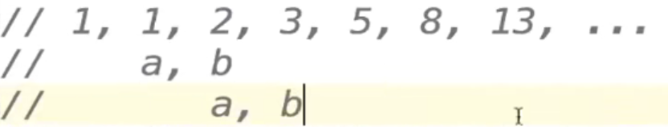

# 使用函数式编程进行开发（1）斐波那契数列

## 斐波那契数列

我们利用函数式编程的思想进行简单的开发，

```go
package main

import "fmt"

func fibonacci() func() int {
   a, b := 0, 1
   return func() int {
      a, b = b, a+b
      return a
   }
}
func main() {
   f := fibonacci()
   fmt.Println(f())
   fmt.Println(f())
   fmt.Println(f())
   fmt.Println(f())
   fmt.Println(f())
   fmt.Println(f())
   fmt.Println(f())
}
```

分析一下这里的调用过程，我们其实本质上保留了a，b的值然后我们通过a,b=b,a+b让斐波那契数列不断向右移动，然后返回较小的那个数字，实现了递归的效果



## 为函数实现接口

然后我们利用前面的接口的知识，现在将斐波那契数列当作文件读出，我们实现一下

```go
package main

import (
   "bufio"
   "fmt"
   "io"
   "strings"
)

type intGen func() int

func fibonacci() func() int {
   a, b := 0, 1
   return func() int {
      a, b = b, a+b
      return a
   }
}
func printFileContent(reader io.Reader) {
   scanner := bufio.NewScanner(reader) //缓冲区的使用
   for scanner.Scan() {
      fmt.Println(scanner.Text())
   }
}

func (g intGen) Read(p []byte) (n int, err error) {
   next := g()
   if next > 10000 {
      return 0, io.EOF
   }
   s := fmt.Sprintf("%d\n", next)
   return strings.NewReader(s).Read(p)
}

func main() {
   f := fibonacci()
   printFileContent(intGen(f))
}
```

简单来说，我们这里先创建了一个类型为返回值为int的intGen，这个实现，是为了让我们可以实现Reader接口，然后方便用于printFileContent的调用