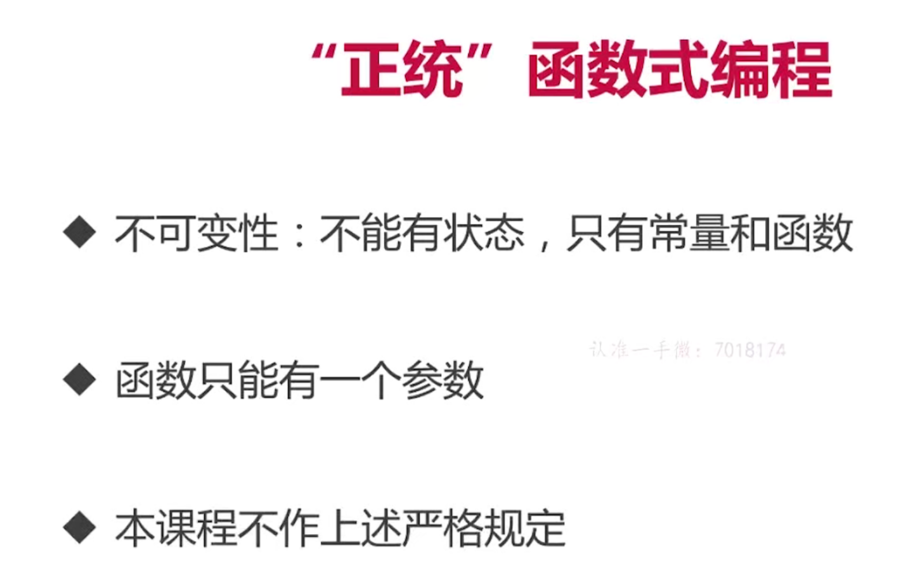
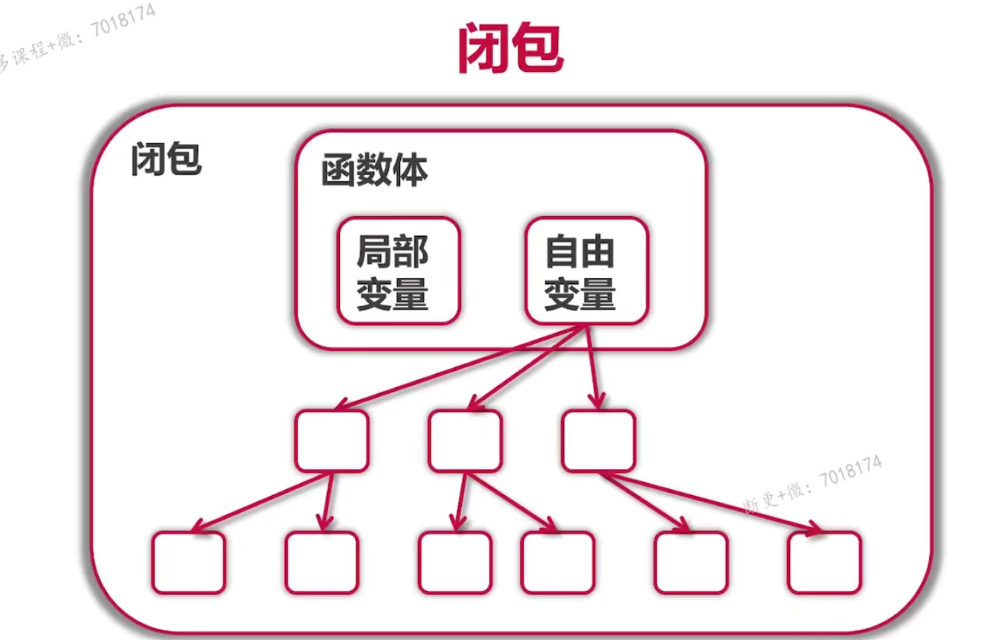
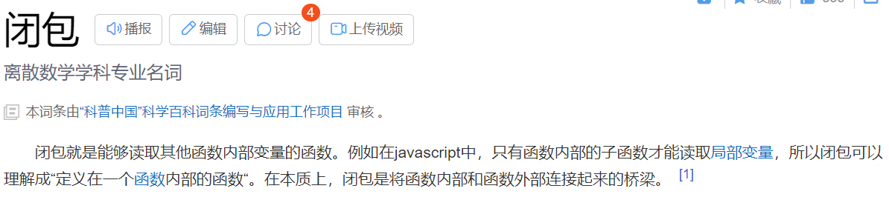
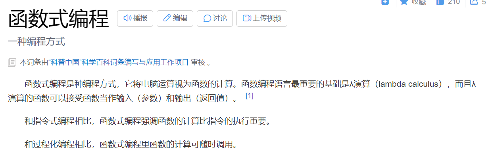
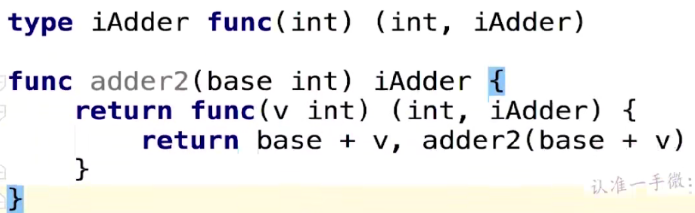
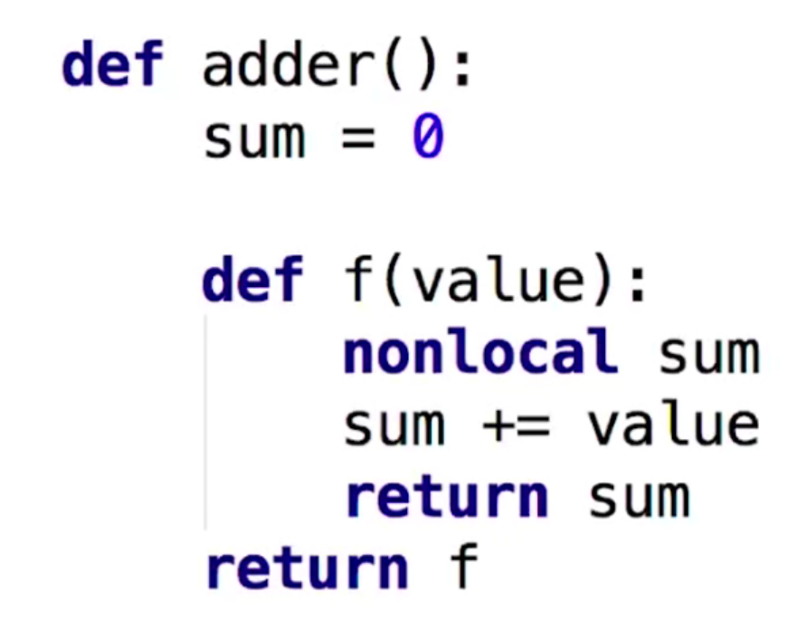
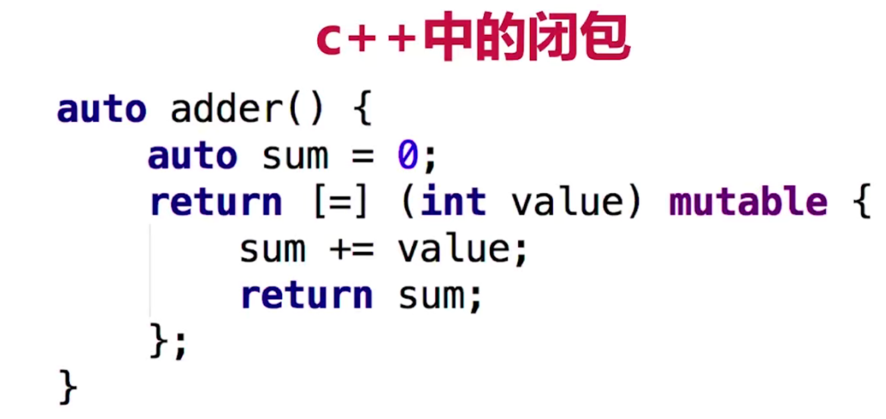
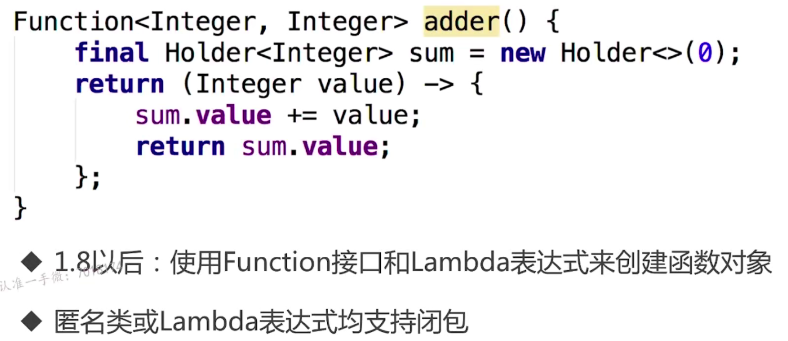

# 函数式编程概念与函数与闭包

## 函数式编程与函数指针



##  所谓的正统的“函数式编程”

- 不可变性：不能有状态，只有常量和函数
- 函数只能有一个参数

我们这里实现一个简单的函数式编程

```go
func adder() func(int) int { //没有参数，但是返回值为一个函数
   sum := 0
   return func(v int) int {
      sum += v
      return sum
   }
}
func main() {
   a := adder()
   for i := 0; i <= 10; i++ {
      fmt.Println(a(i))
   }
}
```

因为对于我自己是第一次接触这个概念，所以我这里稍微认真的分析这个函数，对于a来说，它其实就是一个函数，我们调用了adder()这个函数，然后会给a返回一个以int为参数，int为返回值的一个函数，但是我们发现，其实这里是一个循环，在我们不断调用for的过程中，sum是不会进行释放的，这里是一个特别神奇的地方，这里其实是闭包带来的效果



这里我们定义的sum就是上述的自由变量，而我们的i即为局部变量，这里就不需要向下链接，但是当sum为一个结构体，则会继续访问下面的结构，这样就会形成一颗树，查找到所有需要的变量，然后进行操作，而函数体对应的就是我们这里面定义的adder这个函数，这样我们形成了一个闭包，对于闭包，我们有下面的概念



对于函数式编程我们也有下述的概念



正统的函数式编程如下



这样实现了0-9的部分和

## 其他语言中的闭包

### python中的闭包



这里利用了一个内联函数的定义，然后返回出去，对于python，有

- `python原生支持闭包`
- `可以使用__closure__来查看闭包内容`

### C++中的闭包



- `过去：stl或者boost带有类似的库`
- `C++11及以后：支持闭包`

### java中的闭包

