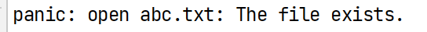
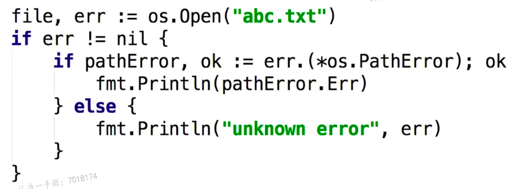
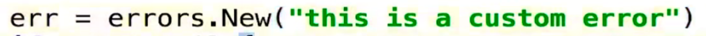
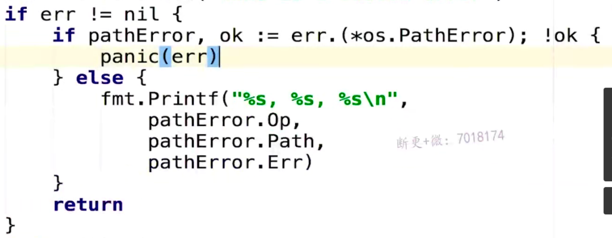

# 错误处理

对于我们打开文件的操作，开始的时候我们使用的是Create，也就是创建一个新的文件，现在我们使用OpenFile来进行操作

```go
file, err := os.OpenFile(filename, os.O_EXCL|os.O_CREATE, 0666) //0666为可读可写的文件
```

我们在第一次创建了这个文件，所以得到的结果为



这样验证了当前的文件存在了



这里进行错误处理，当然我们可以自定义异常



这样也可以进行我们的操作



这里则会打印出我们的自定义的异常