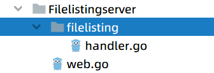

# ※错误处理二 需要重点复习

接下来我们实现错误处理逻辑，我们在这里搭建一个简单的http服务器

```go
package main

import (
   "io/ioutil"
   "net/http"
   "os"
)

func main() {
   http.HandleFunc("/list/", func(writer http.ResponseWriter, request *http.Request) {
      path := request.URL.Path[len("/list/"):] // /list/fib.txt 这里仍然是利用了切片，从list之后开始
      file, err := os.Open(path)
      if err != nil {
         http.Error(writer, err.Error(), http.StatusInternalServerError)
         return
      }
      defer file.Close()
      all, err := ioutil.ReadAll(file)
      if err != nil {
         panic(err)
      }
      writer.Write(all)
   }) //这里可以看到我们当前文件本身
   err := http.ListenAndServe(":8888", nil)
   if err != nil {
      panic(err)
   }
}
```

我们来处理这个err的过程，我们利用了

`         http.Error(writer, err.Error(), http.StatusInternalServerError)`

这一句，第一个为其原型，第二个为error中的字符串，第三个为错误的状态码，我们利用return处理了这个异常，解决了当前的问题，此时用户会看到内部的错误信息。

我们希望将我们的错误信息包装起来，不希望用户看到错误信息，我们进行如下操作

我们先将项目重构，项目结构如下



我们将服务器处理的信息放入到handler.go中，将调用其的方式放入到web.go中，这样我们可以得到结果如下

web.go

```go
package main

import (
   "awesomeProject1/errhandling/Filelistingserver/filelisting"
   "log"
   "net/http"
   "os"
)

type appHandler func(writer http.ResponseWriter, request *http.Request) error

func errWrapper(handler appHandler) func(w http.ResponseWriter, r *http.Request) {
   return func(w http.ResponseWriter, r *http.Request) {
      err := handler(w, r)
      if err != nil {
         log.Printf("Error handling request:%s", err.Error())
         code := http.StatusOK
         switch {
         case os.IsNotExist(err): //没有查找到资源
            code = http.StatusNotFound
         case os.IsPermission(err): //没有权限
            code = http.StatusForbidden
         default: //出现异常
            code = http.StatusInternalServerError
         }
         http.Error(w, http.StatusText(code), code)
      }
   }
}

func main() {
   http.HandleFunc("/list/", errWrapper(filelisting.HandleFileList)) //这里可以看到我们当前文件本身
   err := http.ListenAndServe(":8888", nil)
   if err != nil {
      panic(err)
   }
}
```

handler.go

```go
package filelisting

import (
   "io/ioutil"
   "net/http"
   "os"
)

func HandleFileList(writer http.ResponseWriter, request *http.Request) error {
   path := request.URL.Path[len("/list/"):] // /list/fib.txt 这里仍然是利用了切片，从list之后开始
   file, err := os.Open(path)
   if err != nil {
      http.Error(writer, err.Error(), http.StatusInternalServerError)
      return err
   }
   defer file.Close()
   all, err := ioutil.ReadAll(file)
   if err != nil {
      panic(err)
      return err
   }
   writer.Write(all)
   return nil
}
```

我们设置权限的方式


设置权限为500。