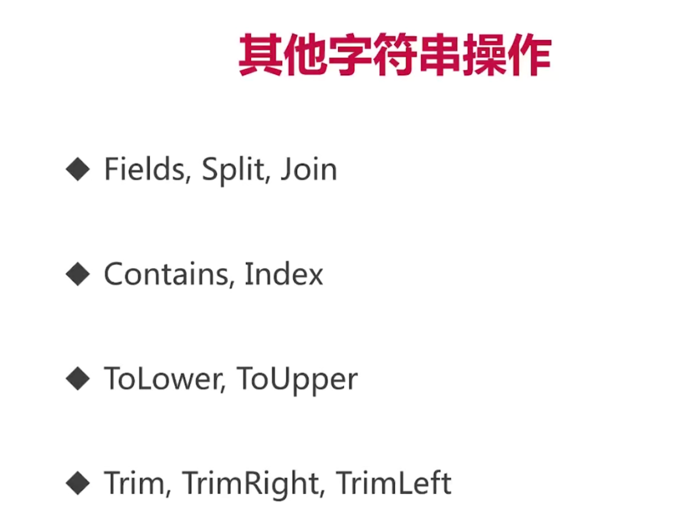

# go语言字符和字符串

## 1.字符类型的定义

rune类型可以认为是go语言的字符，另外一个名称可以认为是int32，为4个字节

## 2.rune字符串的遍历以及其编码

我们在这里先创建一个字符串如下

```go
s := "yes我爱这个世界"
```

然后我们打印其长度

```go
fmt.Println(len(s)) //21
```

发现其长度为19，go语言采用了utf8编码，变长编码，也就是说如果是英文字符，则占一个字节，若是中文字符，则占3个字节，这样可以保证节省空间的情况下可以正确表示各种语言的字符。

那我们又如何遍历输出每一个字符呢，有两种方法，可以先将字符串转化为byte数组，然后利用go语言内置的解码函数，将字符逐一输出，有如下：

```go
bytes := []byte(s)
for len(bytes) > 0 { //拿出每一个字符
   ch, size := utf8.DecodeRune(bytes) //每一次进行解码，然后输出
   bytes = bytes[size:]
   fmt.Printf("%c ", ch)
}
```

当然这里还有一个要说的地方是，我们可以通过内置函数计算字符串中字符的个数

```go
fmt.Println("Rune count:", utf8.RuneCountInString(s)) //打印字符的个数
```

另外一种方法是，我们可以将字符串转化为rune数组，然后逐一输出即可得到结果

```go
for i, ch := range []rune(s) {
   fmt.Printf("(%d %c)", i, ch)
}
fmt.Println()
```

3.字符串的其他操作

这里的定义和java大同小异，就不再进行过多的赘述