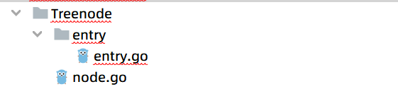
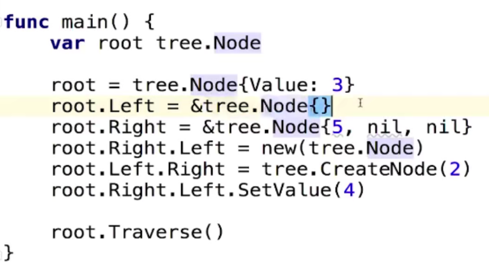

# 包和封装

1.包

- 为结构体定义的方法必须放在同一个包内
- 可以是不同的文件
- **一个目录下只有一个包**

则我们对我们上一节的内容进行一个包的封装，有如下的结果

在上面的结构中，main函数放在entry包下，node放在Treenode下

同时由于go语言的特性，如果要将结构体变为public，则首字母需要大写，即我们刚才定义的结构体需要改为Treenode，变量名称也需要首字母大写，方法名同样如此这样可以实现public，这样的用法比显式声明的修饰符更加简单，同时也有一定的命名技巧，如下

tree.Node相对来说更加明确，这样也方便进行判断