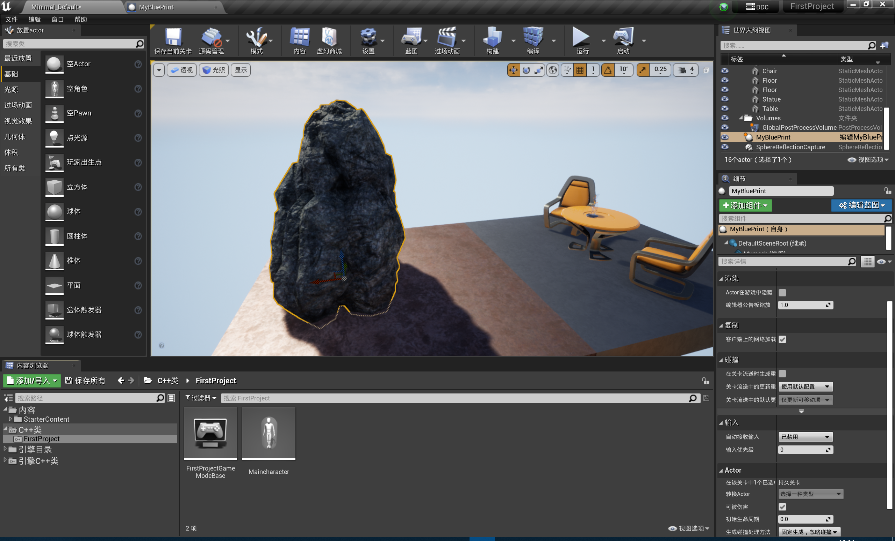

# C++类的创建和使用

## 一、类的创建

首先我们在界面中先打开C++类的文件夹，



之后右键，创建一个类名称为Maincharacter


这里我们创建一个角色，之后会在visual studio中生成两个文件，分别为当前类对应的头文件以及.cpp文件，然后得到了如下的东西


## 二、对自动创建的各个类的分析

首先是对我们创建的这个类的定义的分析：


这里可以看到有一个叫做UCLASS()，这个是UE特有的宏声明，证明下面的类是可以用于UE编辑器的类；

然后我们看到这里的类名叫做Axxxx，这里的“A”代表这里的类继承自Actor，因为character是Actor的子类，也是Actor的一种，后面的那个继承自ACharacter也是一样的意思，这里就是UE内置的类了，所以说在UE创建C++类的过程中，只要是源自Actor类的对象，都会自动在前面加上“A”进行标识。

接下来我们发现，这里面创建的函数，都是虚函数，它的子类甚至可以进行重写对这些函数，这样可以极大的增加C++类的可拓展性


我们上一节的内容是UE4的层级关系，我们这里也可以看到UE4的层级关系，

首先我们看到了当前这个类继承自ACharacter，我们按住ctrl之后点击当前这个类，进入到这个类的定义，发现其继承自APawn


再同样的操作，我们可以看到APawn是一个多重继承的结构


我们再向上查找，AActor，这里还是没有到头，但是跟我们上节课学习的结构完全一致，现在可以看到其继承自UObject


这里按照我们上节课的学习，这里应该是最上层的类了，但是我们此时再进行点击


可以看到其上层还有类，然后我们最终发现最上层的类为UObjectBase


这样我们可以发现一个复杂的类的继承关系。

之后我们回到.cpp文件，这里的代码如下

```cpp
// Fill out your copyright notice in the Description page of Project Settings.


#include "Maincharacter.h"

// Sets default values
AMaincharacter::AMaincharacter()
{
 	// Set this character to call Tick() every frame.  You can turn this off to improve performance if you don't need it.
	PrimaryActorTick.bCanEverTick = true;

}

// Called when the game starts or when spawned
void AMaincharacter::BeginPlay()
{
	Super::BeginPlay();

}

// Called every frame
void AMaincharacter::Tick(float DeltaTime)
{
	Super::Tick(DeltaTime);

}

// Called to bind functionality to input
void AMaincharacter::SetupPlayerInputComponent(UInputComponent* PlayerInputComponent)
{
	Super::SetupPlayerInputComponent(PlayerInputComponent);

}


```

这里全部都是使用Super进行调用，也就是调用了其父类的同名函数。

## 三、总结

在这个看UE源码的过程中，我们逐步理解了UE4中的类的继承结构，并且明白了创建一个新的C++类时我们创建的类的结构，当然我们创建不同类的时候会有不同的结构，但是我们掌握了分析的方法，后面的内容也就大同小异了。
