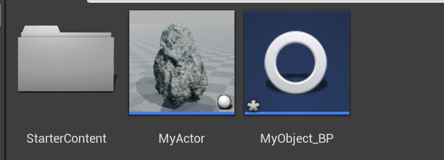

# UObject

这个基本上是第一天学习UE4最后的内容了，这里分为两个部分，在C++类中使用UObject和在蓝图中调用UObject

## 一、在C++类中使用UObject

首先我们还是在ue的C++ classes创建一个UObject类，然后分析这个类的代码


我们可以明显的看到这里仍然是创建了两个文件，分别为.cpp文件和另外一个头文件，这个相比较我们刚才创建的Actor更加简洁，因为这个类更加接近最上层，没有太多的特有的函数，接下来看我们的代码。

```cpp
 // Fill out your copyright notice in the Description page of Project Settings.
/*
MyObject.h
*/
#pragma once

#include "CoreMinimal.h"
#include "UObject/NoExportTypes.h"
#include "MyObject.generated.h" //加载这个头文件，是反射机制必备的头文件，可以进行反射，当然反射之后也方便我们进行垃圾回收

/**
 * 
 */
UCLASS() //在这里定义这个，标志着当前这个类可以参与反射机制
class FIRSTPROJECT_API UMyObject : public UObject
{
	GENERATED_BODY()

};

```

这里我们可以看到在UE编辑器里面的图标如下：


通常我们创建C++类时，我们喜欢创建一个基于该C++类的蓝图，然后我们需要将该类标记为一个可蓝图化的类，我们需要在UCLASS()括号中增加一个选项，`UCLASS(Blueprintable)`，然后我们在vs中构建项目，完成我们的编译，然后我们可以在UE的图形界面中对类右键


创建基于类的蓝图类，就可以创建了


现在得到了这个蓝图类的蓝图，同时在主界面我们也可以得到我们生成的蓝图类



这样就完成了我们的操作，但是它仍然是UObject，不是可以拖入到场景中的Actor类，现在我们可以在蓝图窗口中进行编辑

然后我们回到VS界面，我们对当前的类进行一定的更改，我们创建一个成员变量，一个成员函数，以及无参的构造器

```cpp
// Fill out your copyright notice in the Description page of Project Settings.

#pragma once

#include "CoreMinimal.h"
#include "UObject/NoExportTypes.h"
#include "MyObject.generated.h"

/**
 * 
 */
UCLASS(Blueprintable)
class FIRSTPROJECT_API UMyObject : public UObject
{
	GENERATED_BODY()

	UMyObject(); //构造函数

	UPROPERTY() //将变量显示在反射系统中
	float MyFloat;

	UFUNCTION() //将成员函数显示在反射系统中
	void MyFunction();
};

```

并在.cpp文件中实现构造器以及自定义的函数，我们给其进行宏定义，并不意味着我们可以在UE编辑器中进行访问，我们需要在两个宏定义括号中加入选项


然后为了调用他们我们需要将他们放到public下面，这样才可以进行。

之后我们回到蓝图的操作界面，右键


我们可以搜索到get和set方法，这里是因为我们的选项是ReadWrite，即可读可写

这里是为了展示在蓝图中这些成员变量和函数的显示方式。

今天的学习就完成到这里了，明天再战吧！
