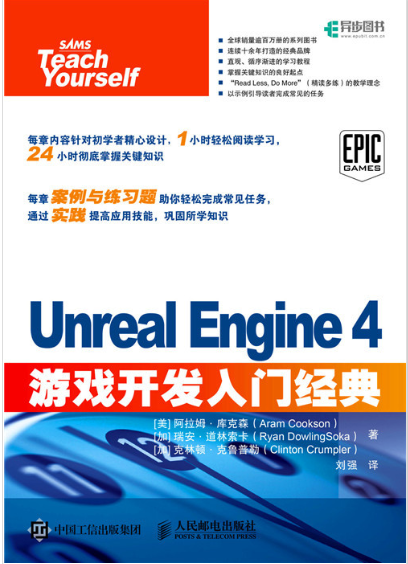

# 前言

7月18日正式开始学习UE，现在在魔方工作室群里面混迹，周围全都是大佬，感觉自己可菜，争取在8月份开始之前可以完成这个C++UE4的学习，然后顺利进入下一个阶段，为了9月份可以拿到offer吧。

现在进入正题，我们要做的是完整的开发一个游戏，用一个半星期开发一个类魂的游戏，然后方便自己进行操作，同时要补充C++语法，然后让自己的知识体系完整起来。

一定要为了自己的未来前行，虽然自己现在不如那些大佬，但是不意味着两个月后你还是什么都不会做，所以要加油每天都内卷起来，最后拿到实习offer

以下是我参考的视频课程以及书籍资料：

UE4蓝图开发：

《Unreal Engine 4 游戏开发入门经典》

UE4 C++开发课程：

[虚幻引擎C++编程关卡游戏独立开发【偏程序向】-技术美术入门【英音中字】视频教程_翼狐网 (yiihuu.com)](https://www.yiihuu.com/a_8952.html)

C++参考课程：

六星教育C、C++软件开发以及游戏开发（钉钉）

C++参考书籍：

C++primer plus
