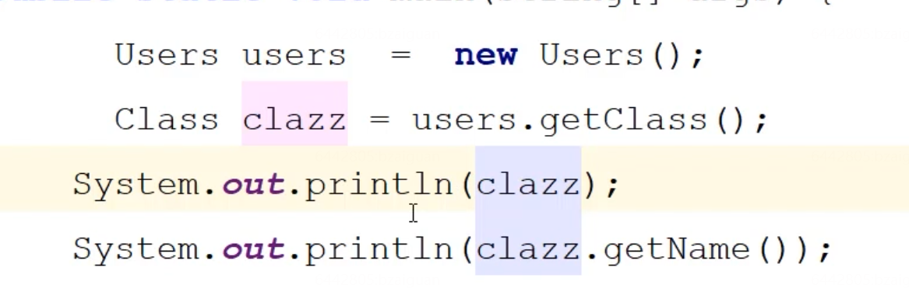
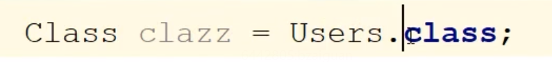
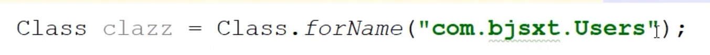
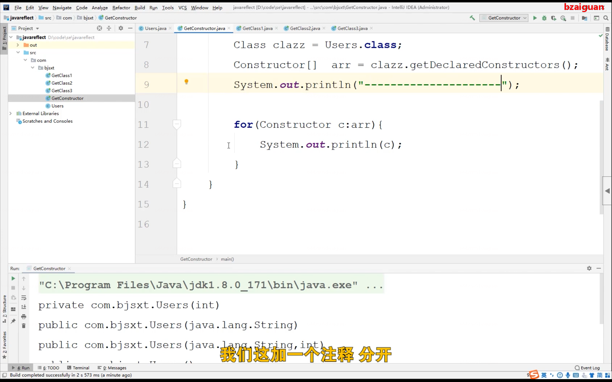
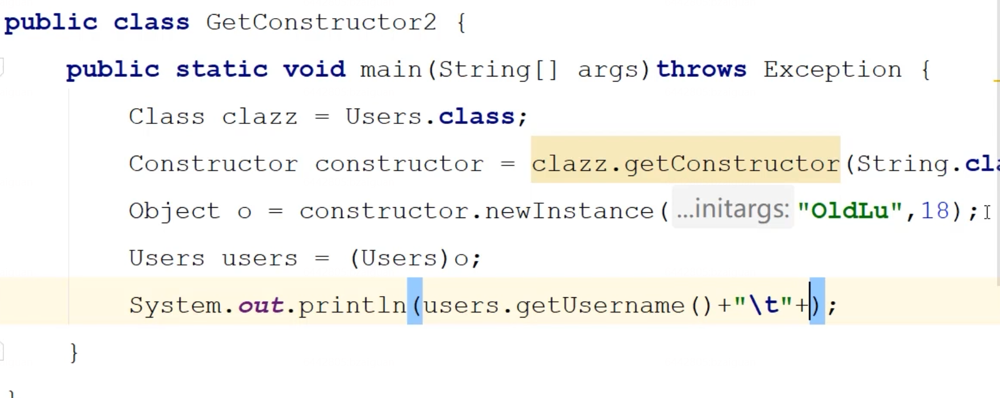
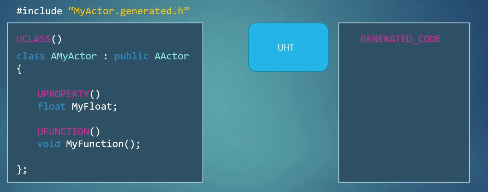

# UE4中的反射和垃圾回收

## 一、反射机制

这里我是对这个理念第一次进行学习，我在这里查询了一些资料，比较通俗易懂的是如下的描述（from：[反射 - 廖雪峰的官方网站 (liaoxuefeng.com)](https://www.liaoxuefeng.com/wiki/1252599548343744/1255945147512512)）

### **我们先以java开头**

什么是反射

反射就是Reflection，Java的反射是指程序在运行期可以拿到一个对象的所有信息。

正常情况下，如果我们要调用一个对象的方法，或者访问一个对象的字段，通常会传入对象实例：

```java
// Main.java
import com.itranswarp.learnjava.Person;

public class Main {
    String getFullName(Person p) {
        return p.getFirstName() + " " + p.getLastName();
    }
}
```

但是，如果不能获得 `Person`类，只有一个 `Object`实例，比如这样：

```java
String getFullName(Object obj) {
    return ???
}
```

怎么办？有童鞋会说：强制转型啊！

```java
String getFullName(Object obj) {
    Person p = (Person) obj;
    return p.getFirstName() + " " + p.getLastName();
}
```

强制转型的时候，你会发现一个问题：编译上面的代码，仍然需要引用 `Person`类。不然，去掉 `import`语句，你看能不能编译通过？

所以，反射是为了解决在运行期，对某个实例一无所知的情况下，如何调用其方法。

这里使用了之后其实我只能理解一点点，所以我就来求助万能的b站了，这里是我参考的内容

[25分钟带你了解Java反射原理_哔哩哔哩_bilibili](https://www.bilibili.com/video/BV13q4y1s7U8?spm_id_from=333.337.search-card.all.click&vd_source=b7e534bd93c0324ad6556e779ede5f5e)


### 关于反射机制的总结：

动态性语言：程序运行时，我们可以改变程序的结构或者变量的类型，对于任意一个类，我们通过反射机制可以知道这个类的属性和方法，对于任意一个对象，我们可以动态调用其中的方法。

反射机制的意义在于，在没有反射机制的条件下，如果我们想看到一个类的结构，那么我们需要通过看源代码的方式才能了解到这个类的结构，而在于有反射结构的语言下，我们可以通过反射机制定义下的某些方法，获取到一个类的信息，明确它有什么方法，这样也就是它的意义。

对于java的反射机制依赖于Class对象，每一个类都是一个Class对象，有如下的方法



这样我们在开始的时候创建了Users类的实例对象，其实同时也把Users这个Class对象加载到了内存当中，我们可以通过users.getClass()方法获得Class对象。



这样也可以获得Class对象，当JVM发现在内存中没有这个Class对象时，会将Users类加载到内存当中，这里我们也是粗略理解就可以了，当然我们还有以下的方法进行



之后我们可以通过这个拿到的Class对象，可以获得构造方法等一类方法，例如下面的获取构造方法，这里是获取一个Constructor对象数组，这样可以获取到全部的构造方法



之后的内容我就简略写一下吧

利用获得的构造器创建实例对象



然后就是什么创建实例对象

获取方法

调用方法


## 二、UE4反射机制

接下来就是我们使用的UE4的反射机制了

[UE_反射编程基础合集_哔哩哔哩_bilibili](https://www.bilibili.com/video/BV1MF411z78h?spm_id_from=333.999.0.0&vd_source=b7e534bd93c0324ad6556e779ede5f5e)

这里是之后需要看的课，补充一下自己的基础。

UE4的底层为C++，C++没有自己内置的反射机制，这样相比较Java，需要自己实现反射机制（os：据说java是用C、C++实现的，那么如果自己实现就是在做这个东西了），但是UE4为我们提供了反射机制，方便我们在开发中使用

### 1.实现机制以及重点部分

负责数据的收集：

* 该系统负责合并C++数据与虚幻编辑器系统
* 在蓝图中显示出来：这一点我可以理解，蓝图是图形化的界面，在这个过程中难免遇到需要方法相互的调用的情况，这个时候如果利用反射机制获取到类中的方法，那么便可以实现这样的结果。
* 负责垃圾回收机制：会自动删除无需再使用到的对象，这样便释放了（这里有一个需要注意的地方，需要复习一下垃圾回收的两种机制），在UE4中使用的是计数器的方式，如果有一个调用则计数器会+1。
* 反射机制的调用方法，通过特殊的宏声明让反射系统可以看到当前的类，当然这里的机制如图

  
* 我们需要对类前面宏定义为UCLASS()，对类的成员变量宏定义为UPROPERTY()，对类的方法宏定义为UFUNCTION()，才可以被UHT（虚幻头工具：用于收集此类信息）记录，然后存储到生成的代码区里面，这样很好的完成了反射的任务
* 但是我们这里的垃圾回收机制和这里的反射机制的关系是什么呢，反射机制是将类以及其中的数据进行收集，为了让类被识别，而垃圾回收机制需要让这些类的对象被特定识别，这样就需要用到了反射机制。
