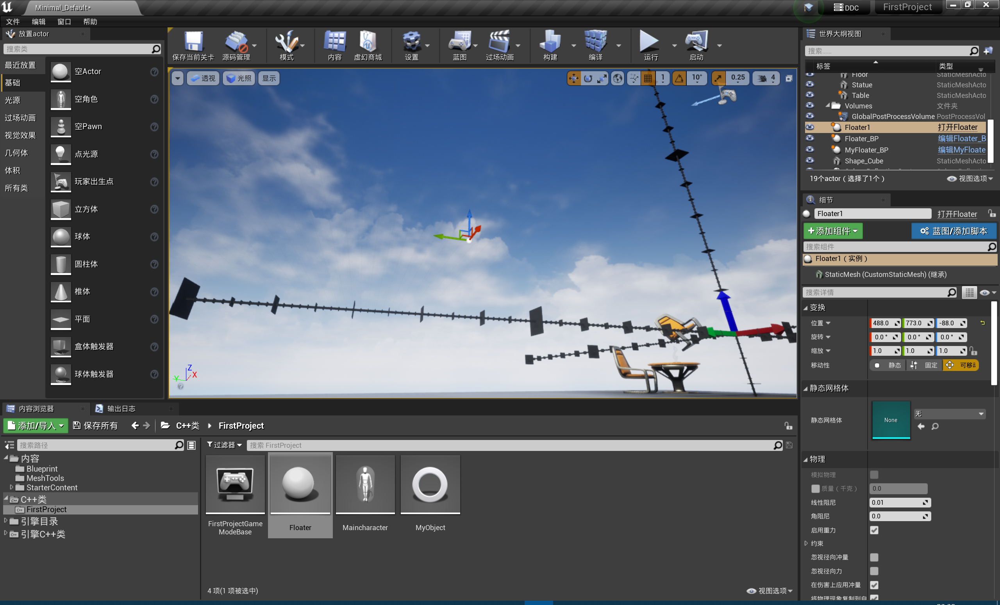
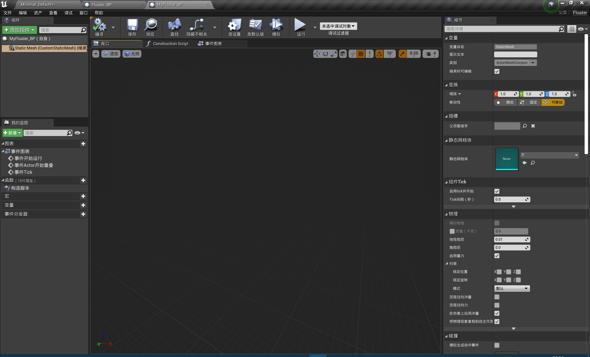

# Actor介绍

我们进入了正式的学习了，前面的知识都是一些基础，现在正式开始一些游戏开发的相关内容，之后的内容将在课后重新看的时候再总结，现在主要的是跟着一起操作了。

## 一、Actor

我们昨天的学习过程中知道，Actor类可以放置在关卡中，可以拥有外观，可以被玩家观察到。

我在这个过程中也逐步发现，这个Actor更多的是用于创建场景，一些死的场景，例如桌椅，板凳，墙面等一些比较死的场景，这些场景可以加入一些物理效果，例如碰撞、移动、滚动一类的基本操作，结合图形界面和C++进行简单动画的实现是今天的主要课题。

## 二、对网格的理解

创建一个C++对象，我们会发现只有一个，而把这个球拖动到界面中然后运行，我们会发现它其实显示不出来，（下图中Floater是我们创建的类）



我们生成基于当前C++类的蓝图类，当然也是一个球了


但是我们可以看到左侧有一个属性叫做DefaultSceneRoot，这里也就是默认的场景，也就是看不到的状态，我们新建一个立方体网格，

也就得到了当前的效果了，但是有一个问题是当前的Cube是在默认场景的下面，也就是不是最上层，当我们在界面上操作然后end之后，会发现模型穿模，而不是立方体的底部和地面的底部重合，而是中间的小球和底部重合，现在我们拖动cube然后覆盖上面的默认场景


现在就得到了一个立方体在最上层的情况。

所以说，网格更类似于给对象加上了一层皮肤，让这个物体丰满了起来，同时网格也可以具有一些属性，让当前创建的物体满足我们需要的效果。

## 三、在C++中创建网格

我们学习了用图形界面来创建之后，来说明如何用代码实现创建网格。

网格其实是一个组件，用于丰满物体，然后让物体具有一些物理上的特效。

我在白天的时候创建了一个C++类叫做Floater，这个是我今天学习主要使用的类，然后我们先看里面的.h文件

```cpp
// Fill out your copyright notice in the Description page of Project Settings.

#pragma once

#include "CoreMinimal.h"
#include "GameFramework/Actor.h"
#include "Floater.generated.h"

UCLASS()
class FIRSTPROJECT_API AFloater : public AActor //Actor不需要声明Blueprintable了，因为已经继承了这个属性了
{
	GENERATED_BODY()

public:
	// Sets default values for this actor's properties
	AFloater();

	//这里是创建的静态网格对象
	//网格对象就是一个几何体，可以说是给这个UE对象的皮肤一类的东西
	UPROPERTY(VisibleAnywhere,BlueprintReadWrite, Category = "ActorMeshComponents")
		UStaticMeshComponent* StaticMesh;    //在游戏编程中如果不是基本变量类型，则更多的使用指针来进行

		/*第一个变量EditInstanceOnly代表该变量只能在Floater的实例下才可以进行操作
		* 当我们基于这个C++类创建一个蓝图类的时候，不能在默认情况下搜索到这个变量，同时也无法更改这个变量
		* 而在我们的关卡编辑界面点击这个实例对象的时候才可以修改
		*/
		//Location used by SetActorLocation() when BeginPlay() is called
	UPROPERTY(EditInstanceOnly, BlueprintReadWrite, Category = "Floater Variables")
		FVector initialLocation;


	// Location of the Actor when dragged in from the editor
	//前面的判断VisibleInstanceOnly意味着不希望在实例中对其进行更改，而是只能见到不能进行操作
	UPROPERTY(VisibleInstanceOnly, BlueprintReadWrite, Category = "Floater Variables")
		FVector PlacedLocation;


	/*
	* VisiableDefaultOnly，只能在蓝图界面进行查看，而不能编辑
	*/
	UPROPERTY(VisibleDefaultsOnly, BlueprintReadOnly, Category = "Floater Variables")
		FVector WorldOrigin;

	/*
	* 可以在任何地方进行编辑
	* 注意这里的拼写错误，我tm傻了
	*/
	UPROPERTY(EditAnywhere, BlueprintReadOnly, Category = "Floater Variables")
	FVector InitialDirection;

	UPROPERTY(EditAnywhere, BlueprintReadOnly, Category = "Floater Variables")
	bool bShouldFloat; //用于标志物体是否可以浮动旋转
	/*
	* EditDefaultOnly，可以在蓝图界面进行编辑
	* 可以在默认模式下编辑
	*/
	UPROPERTY(EditDefaultsOnly, BlueprintReadWrite, Category = "Floater Variables")
	bool bIntializeFloaterLocations;

protected:
	// Called when the game starts or when spawned
	virtual void BeginPlay() override;

public:
	// Called every frame
	virtual void Tick(float DeltaTime) override;

};

```

这里UStaticMeshComponent就是我们创建的静态网格对象，上面也有说明，一般情况下，我们使用的是指针，除非是基本变量类型。

然后我们可以在基于当前类的蓝图中看到我们创建的这个静态网格对象



然后我们点击这个网格对象可以看到这里的变量名和我们刚才在C++中创建的变量名一致，然后我们可以修改静态网格体，让其具有一定的形状


这样我们就实现了创建一个网格对象的操作。

## 四、UPROPERTY中可选参数说明

对于这个UPROPERTY宏指令，我们在昨天了解到这个是为了让反射系统认识我们这个变量，反射系统的主要作用是让我们在蓝图中或者是在图形操作界面中识别这个类，然后对类的这些变量进行操作，其实相当于，将类的定义加载到了UE引擎中，让我们可以通过图形的方式去完成一些赋值，调用函数的操作，但是这些可选参数的具体作用是什么呢？

BlueprintReadWrite  变量在蓝图中可读可写，这个我们在前一节课中有讲，我们可以在蓝图中get，set方法来进行，然后其实还有一个是我们可以通过右侧的操作栏进行

Category 这个是我们在右侧的操作栏中显示的分类，便于我们进行管理，这个需要举例一下，例如我们上面的C++代码，我们将所有的变量归类为Floater Variables，我们在操作界面中现实的效果就是右侧有Floater Variables，这里就是我们使用该参数的作用


EditAnywhere 这个意味着我们可以在任何地方操作这个变量，什么叫做任何地方呢，这里也需要解释一下，在下面的图中我们可以看到我们点击放在level中的实例对象之后，我们在右侧有Floater Variables，也就是意味着我们可以操作，这里也就是实例对象的操作，然后是在蓝图界面的操作，也就是完整的操作一整个类，在第二张图中我们可以看到右侧有Floater Variables，也就是可以在蓝图中操作，所以说Anywhere也就是我们在以下两个地方操作，也就是说，我们可以操作类，或者是实例对象的操作，这里我们可以做到这两个方面的控制


VisibleAnywhere 就是在这两个方面可读，不能进行操作

EditInstanceOnly 这个就是只能在实例对象可写

EditDefaultsOnly 这个就是只能在类操作窗口里面可写

剩下的构成格式是一样的，需要注意的是，这里的拼写，如果错了会报8k多个错误，Defaults 和 Visible都需要注意，这里就结束到这里就好了

## 五、在C++中对函数的操作

我们在.cpp文件中写入如下的东西

```cpp

// Fill out your copyright notice in the Description page of Project Settings.


#include"Floater.h"

// Sets default values
AFloater::AFloater()
{
 	// Set this actor to call Tick() every frame.  You can turn this off to improve performance if you don't need it.
	PrimaryActorTick.bCanEverTick = true;

	StaticMesh = CreateDefaultSubobject<UStaticMeshComponent>(TEXT("CustomStaticMesh"));
	initialLocation = FVector(0.0f, 0.0f, 0.0f);
	PlacedLocation = FVector(0.0f);
	WorldOrigin = FVector(0.0f, 0.0f, 0.0f);
	InitialDirection = FVector(0.0f, 0.0f, 0.0f);
	bShouldFloat = false;
	bIntializeFloaterLocations = false;
}

// Called when the game starts or when spawned
void AFloater::BeginPlay()
{
	Super::BeginPlay();//游戏开始时会调用所有Actor对象的BeginPlay()方法
	PlacedLocation = GetActorLocation();
	/*
	* when the variable is true,the operation takes up
	*/
	if (bIntializeFloaterLocations) {
		SetActorLocation(initialLocation);
	}

}

// Called every frame
void AFloater::Tick(float DeltaTime)
{
	Super::Tick(DeltaTime);
	if (bShouldFloat) {
		/*
		* HitResult：标识某一碰撞命中之后会发生的结果，存储了碰撞时的一些信息
		*/
		FHitResult HitResult;
		//第一个参数为每一帧改变的方向，第二个参数为一个bool型变量的值为bSweep 不要执行扫除的操作 也就是可以穿越网格，如果我们设置为true则可以穿越网格，第三个参数为FHitResult
		AddActorLocalOffset(InitialDirection,true,&HitResult); 
		FVector HitLocation = HitResult.Location;
		int a = 1;
		UE_LOG(LogTemp, Warning, TEXT("Hit Location: X=%f,Y=%f,Z=%f"), HitLocation.X, HitLocation.Y, HitLocation.Z);
	}
}


```

我们在构造器里面初始化了变量，然后在Tick函数里面进行了一些操作，当bShouleFloat为true的时候我们可以进行一些操作，写入日志，然后让物体进行移动，这样我们就实现了一个基础物体的移动，其中有一个函数需要注意AddActorLocalOffset()，其中第一个参数是一个方向矢量，第二个参数是一个布尔型变量，当为true时，不允许网格间互相穿越，当为false时，允许网格间的互相穿越，第三个变量，标志着网格体碰撞时的状态，例如碰撞时的位置，碰撞的时间等，用于记录碰撞的一切信息。

## 六、矢量

在UE中定义了一种变量，FVector，这是一个结构体，这里要说一下UE的命名规则，对于结构体首字母为F，对于UObject类，首字母为U，对于UActor类，首字母为U，包含了三个变量，X,Y,Z，为矢量的三个方向，这里的运用，可以作为方向角，也可以作为物体坐标（其实是相对于原点的方向角），这样也就完全了

## 七、添加力、碰撞等

## 八、局部与世界偏移

## 九、力矩与扭矩

## 十、UE中数学函数库的应用

### 1.随机数

### 2.三角函数
