# 在蓝图中运用UObject

我们昨天创建了一个自己的UObject，并且像其中添加了可选的参数，然后我们今天需要再增加一个参数

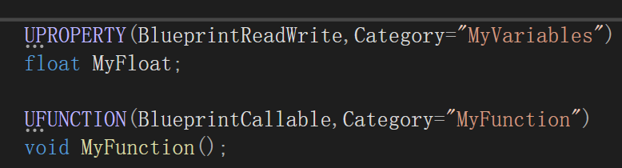

Category这个参数的作用是什么呢，我们是需要在蓝图下显示这些变量以及函数的，那么我们这里可以让其方便分类，如图所示，

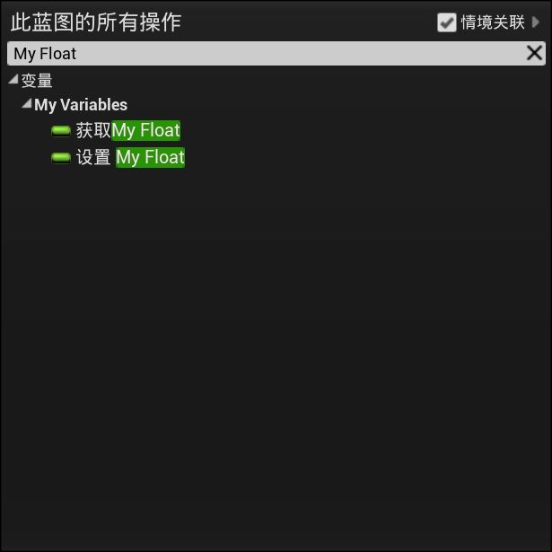

我们再右键添加节点的时候，就会进行分类，这样便于我们进行查找，当然对于我们的第一个参数也有相关的操作，例如我们不想在蓝图中该类被写入，我们可以第一个参数改为BlueprintReadOnly，这样就变味了只读状态，也就是只能获取My Float。

我们创建这个类的作用是为了在蓝图中可以调用它，之后我们进行操作，我们点开我们之前创建的MyActor。

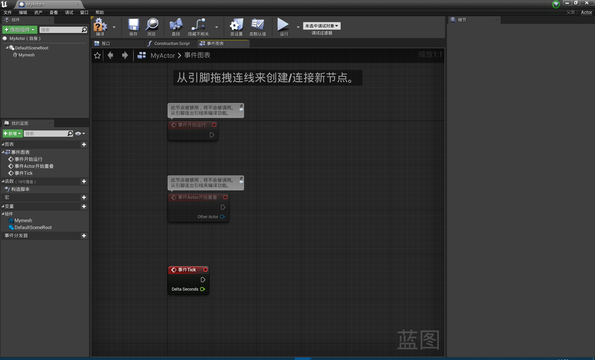

点击左侧的新增，增加新的变量，我们可以双击一下新创建的变量

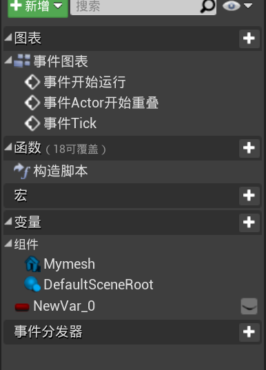

然后我们可以修改变量的类型

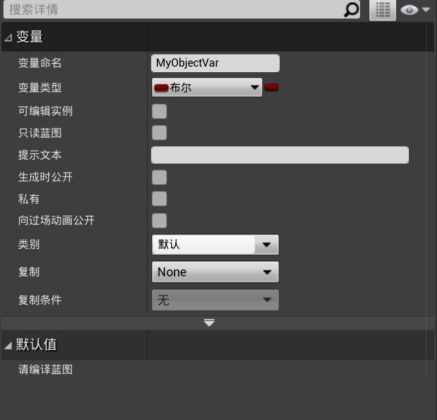

更改为我们创建的MyObject BP

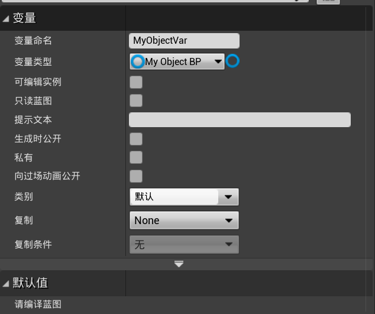

现在得到了一个Object的蓝图对象

拖入到蓝图编辑界面当中选择get

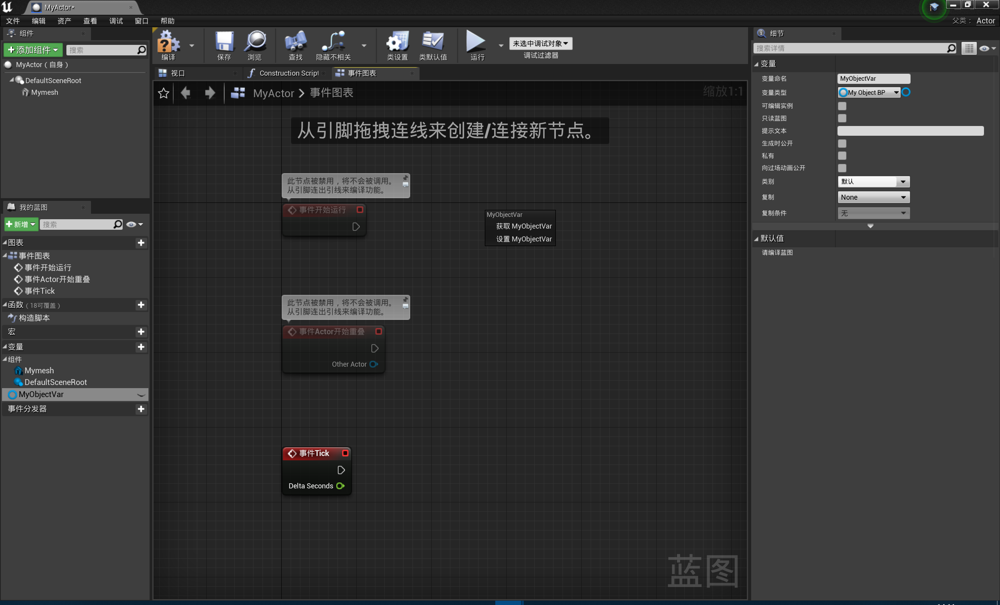

这样我们可以得到蓝图类，然后我们让其调用Myfunction方法，在这里说明一下，我们在进行操作之前更改了Myfunction里面的内容，改为

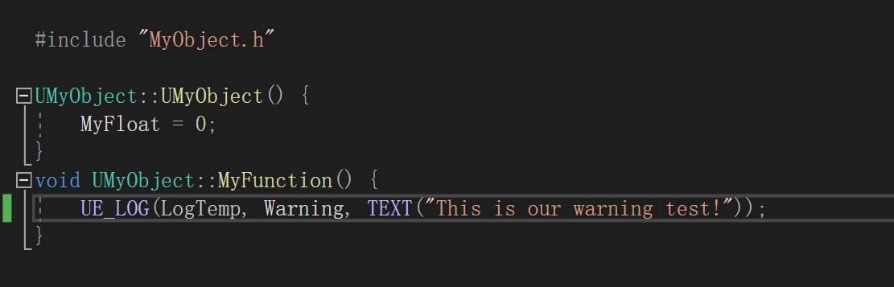

我们利用了UE_LOG进行操作，对于其中的变量，第一个为LogTemp，说明当前的日志是临时的，Warning，说明当前的变量是用于警告，第三个为打印出来的内容，这个调用之后会在UE的日志窗口中出现。

我们点击编译，然后观察我们的变量默认值

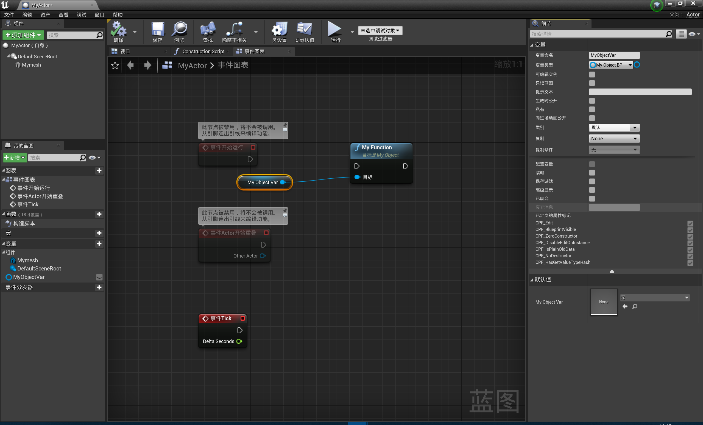

发现当前默认值为none，也就是相当于空指针一个操作，现在不能正确执行函数，那么我们需要正确的创建一个对象

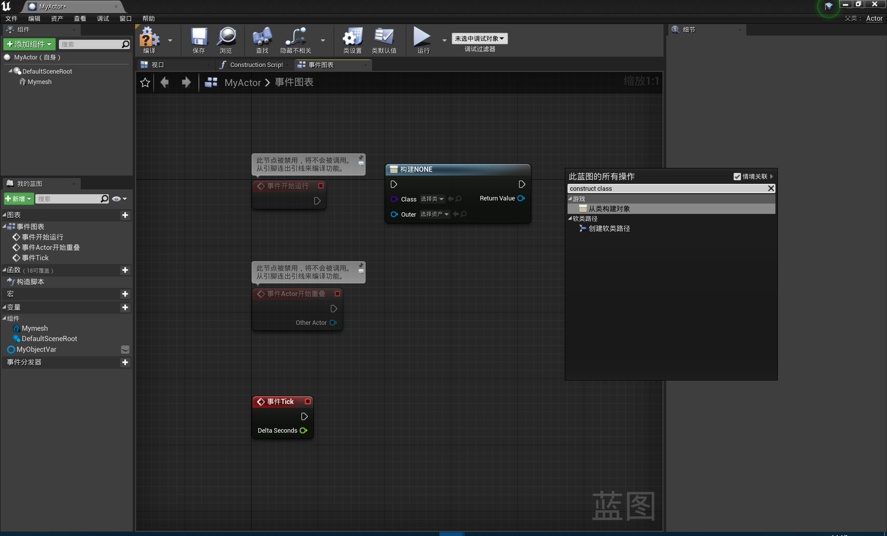

我们右键搜索“construct object from class”然后就会出现构造对象，我们这里选择构造器MyObject BP，下面的outer选项选择我们的MyActor，因为当前的对象在MyActor这个类内部构建的，然后我们用set方法可以将我们刚才创建的那个空对象进行创建

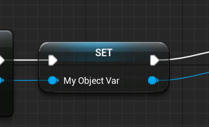这里要注意的是蓝色的节点会有一个输出，是My Object Var，这样我们就完成了我们的任务，白色的线为流程控制，蓝色的为值传递，这样还是很简单的

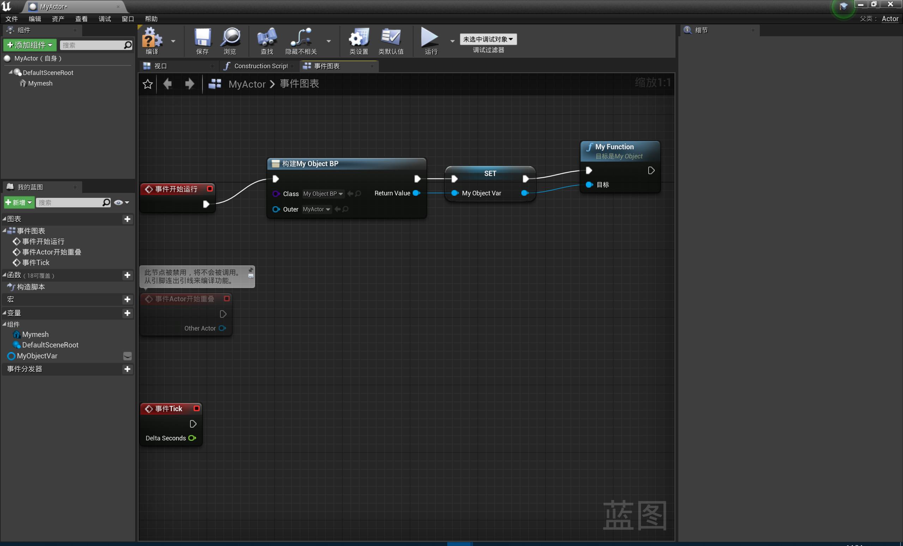

然后当前我们学习这个部分就完成了
