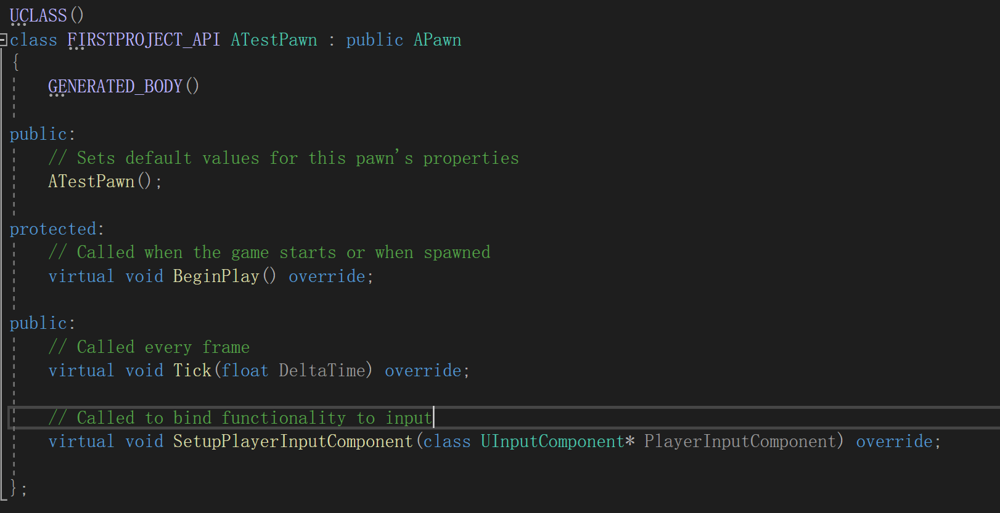
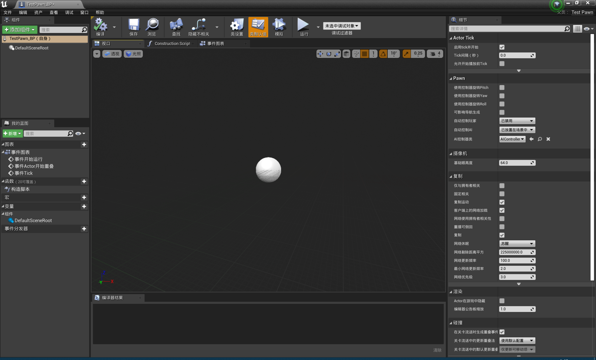
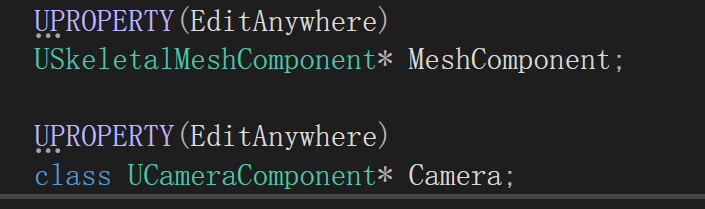
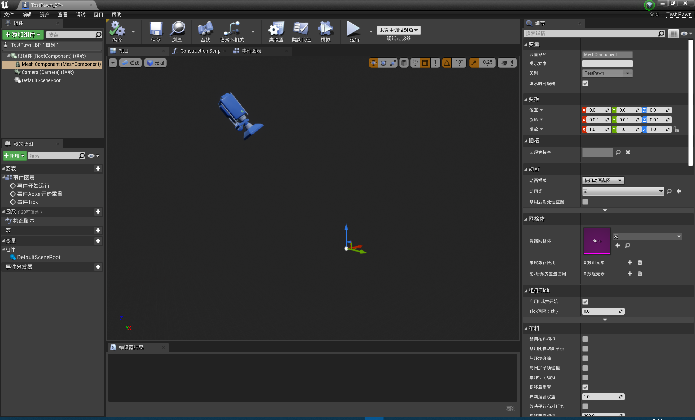
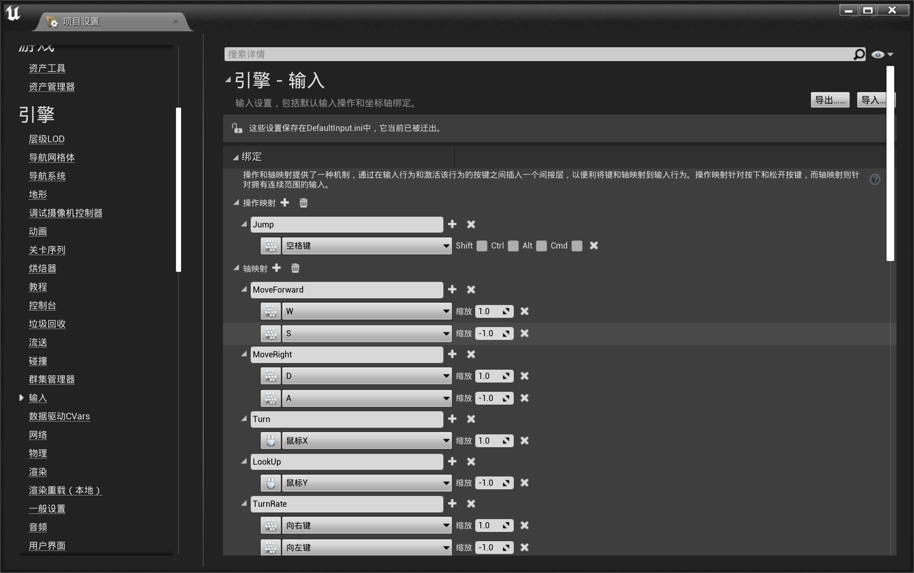
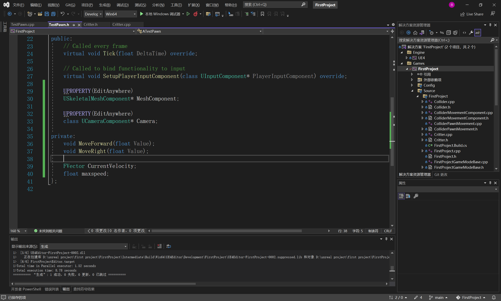
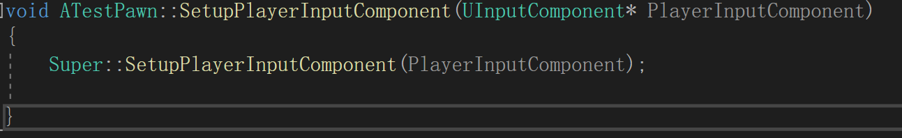

# Pawn

Pawn在我们第一天的学习中知道了，这个类可以接收用户的输入，即一些操作之类的，这个一般用于构建玩家可操作物体，而不是单纯的死物了。

Pitch支持鼠标的上下移动

yaw支持鼠标的左右移动

## 一、一些基础概念

Gamemode：游戏模式

edit->项目设置->input

Action Mappings操作映射（动作映射）通过按下键盘一次性函数

Axis Mappings 会被持续调用，不是一次性的，可以检测对控制器实施的压感，也就是所谓可以检验程度，可以在0-1之间获得一个值

## 二、Pawn的移动输入

在这里我们会讨论如何让一个Pawn类动起来，也就是如何让其根据我们在键盘上的输入进行移动，由于这里我已经听完课并且已经完整实践过一遍了，所以这里先放我原本的代码，然后我创建一个新的类，自己重新实现一遍。

Critter.h

```cpp
// Fill out your copyright notice in the Description page of Project Settings.

#pragma once

#include "CoreMinimal.h"
#include "GameFramework/Pawn.h"
#include "Critter.generated.h"

UCLASS()
class FIRSTPROJECT_API ACritter : public APawn
{
	GENERATED_BODY()

public:
	// Sets default values for this pawn's properties
	ACritter();

protected:
	// Called when the game starts or when spawned
	virtual void BeginPlay() override;

public:
	// Called every frame
	virtual void Tick(float DeltaTime) override;

	// Called to bind functionality to input
	//用户输入组件
	virtual void SetupPlayerInputComponent(class UInputComponent* PlayerInputComponent) override;

	//静态网格
	UPROPERTY(EditAnywhere)
	USkeletalMeshComponent* MeshComponent;

	//摄像机
	UPROPERTY(EditAnywhere)
	class UCameraComponent* Camera;//前面标识class 告诉编译器，之后会引入这个文件 

private:

	void MoveForward(float Value);
	void MoveRight(float Value);

	//用于标志按下按键之后的移动方向
	FVector CurrentVelocity;
	float maxspeed;
};

```

Critter.cpp

```cpp
// Fill out your copyright notice in the Description page of Project Settings.


#include "Critter.h"
#include"Components/StaticMeshComponent.h" //这个其实没有必要引入，因为UE4已经逐步优化了项目结构，现在其实是可以直接调用的
#include"Camera/CameraComponent.h"//这个是必须要引入的
// Sets default values
ACritter::ACritter()
{
 	// Set this pawn to call Tick() every frame.  You can turn this off to improve performance if you don't need it.
	PrimaryActorTick.bCanEverTick = true;


	//init RootComponent 场景组件  ？？ 这里还是需要深入理解
	RootComponent = CreateDefaultSubobject<USceneComponent>(TEXT("RootComponent"));

	MeshComponent = CreateDefaultSubobject<USkeletalMeshComponent>(TEXT("MeshComponent"));

	//这里将静态网格组件附加到了场景组件下面了
	MeshComponent->SetupAttachment(GetRootComponent());

	Camera = CreateDefaultSubobject<UCameraComponent>(TEXT("Camera"));
	//这个就需要手动添加这个头文件了
	Camera->SetupAttachment(GetRootComponent());
	Camera->SetRelativeLocation(FVector(-300.f, 0.f, 300.f));
	Camera->SetRelativeRotation(FRotator(-45.f, 0.f, 0.f));

	//设置摄像头默认观看着我们的Pawn，然后我们可以对其执行一定的操作
	// 定义之后不会移动
	//AutoPossessPlayer = EAutoReceiveInput::Player0;

	CurrentVelocity = FVector(0.f);
	//最大的速度
	maxspeed = 100.f;
}

// Called when the game starts or when spawned
void ACritter::BeginPlay()
{
	Super::BeginPlay();

}

// Called every frame
void ACritter::Tick(float DeltaTime)
{
	Super::Tick(DeltaTime);
	FVector NewLocation = GetActorLocation() + (CurrentVelocity * DeltaTime);
	SetActorLocation(NewLocation);//转换到新的位置
}

// Called to bind functionality to input
//用户输入的信息由这个PlayerInputComponent来记录
void ACritter::SetupPlayerInputComponent(UInputComponent* PlayerInputComponent)
{
	Super::SetupPlayerInputComponent(PlayerInputComponent);

	//开始绑定控制器
	PlayerInputComponent->BindAxis(TEXT("MoveForward"), this,&ACritter::MoveForward);
	PlayerInputComponent->BindAxis(TEXT("MoveRight"), this, &ACritter::MoveRight);

}

void ACritter::MoveForward(float Value) {

	CurrentVelocity.X = FMath::Clamp(Value, -1.f, 1.f)*maxspeed;//确保数值在这个范围内 如果超出则会压缩回当前的位置

}

void ACritter::MoveRight(float Value) {
	CurrentVelocity.Y = FMath::Clamp(Value, -1.f, 1.f) * maxspeed;//确保数值在这个范围内 如果超出则会压缩回当前的位置

}
```

上面的是我在听课的过程中创建的类，然后我现在自己新建一个类然后实现我们当时的效果

创建完毕之后，类的实体如下



然后我们可以看到BeginPlay()，当游戏开始时，会调用这个函数

Tick()还是跟Actor中一致，每一帧都会调用这个函数

然后是SetupPlayerInputComponent()这个函数是接收用户使用的

然后我们先要完整这个类，我们当然第一步是构建这个类的蓝图类



我们发现这个只含有一个默认的场景组件，游戏进行视角切换都是依赖摄像头来实现的，我们现在创建一个Camera，同时可以发现其没有网格对象，我们也需要创建一个网格对象，我们这一次不使用静态网格，而是采用骨骼网格，这样我们可以让我们创建的对象具有怪物的模型的操作，这里都是public访问，然后我们进行初始化

注意这里我们需要引入一个新的库 `#include"Camera/CameraComponent.h"`

这样编译器才可以正确识别CameraComponent



构造器如下

```cpp
// Sets default values
ATestPawn::ATestPawn()
{
 	// Set this pawn to call Tick() every frame.  You can turn this off to improve performance if you don't need it.
	PrimaryActorTick.bCanEverTick = true;

	//初始化根场景
	RootComponent = CreateDefaultSubobject<USceneComponent>("RootComponent");

	//初始化网格
	MeshComponent = CreateDefaultSubobject<USkeletalMeshComponent>("MeshComponent");

	//初始化相机
	Camera= CreateDefaultSubobject<UCameraComponent>("Camera");
}
```

我们需要将网格对象和相机都附加在根场景之下，这样我们可以完整的得到一个对象，同时我们需要设置摄像机的位置，这里我们采用向下俯瞰45度的方法，同时摄像机跟在物体的后面

这样我们就得到了新的结果

```cpp
ATestPawn::ATestPawn()
{
 	// Set this pawn to call Tick() every frame.  You can turn this off to improve performance if you don't need it.
	PrimaryActorTick.bCanEverTick = true;

	//初始化根场景
	RootComponent = CreateDefaultSubobject<USceneComponent>(TEXT("RootComponent"));

	//初始化网格
	MeshComponent = CreateDefaultSubobject<USkeletalMeshComponent>(TEXT("MeshComponent"));
	MeshComponent->SetupAttachment(RootComponent);

	//初始化相机
	Camera= CreateDefaultSubobject<UCameraComponent>(TEXT("Camera"));
	Camera->SetupAttachment(RootComponent);
	Camera->SetRelativeLocation(FVector(-300.f, 0.f, 300.f));
	Camera->SetRelativeRotation(FRotator(-45.f, 0.0f, 0.0f));
}
```

然后我们构建项目得到结果



我们得到了上面的结果，这样我们就有了摄像机和物体，然后我们开始想办法添加物体的运动，首先我们在UE4编辑器中菜单栏->编辑->项目设置->输入，然后可以看到如下的界面



我已经进行了一些设置，这里是编辑引擎的输入，可以看到轴映射和操作映射，操作映射一般用于短时的动作，因为操作映射可以区分按下和弹起的动作，同时在按下和弹起可以绑定不同的操作，轴映射一般用于角色移动等操作，我们在轴映射中创建MoveForward和MoveRight，同时将下面设置上如上的按键，这个的含义是，当我们按下这些按键之后，虚幻引擎会将数值返还给我们绑定的函数，然后我们设置的函数可以接收这个数值，根据不同的数值进行一定的操作，这里其实需要记住一下，就是说在前进后退这里UE4倾向于前为1，在左右这里，UE4倾向于右为1，这个在后面我们使用Character进行角色控制时我们可以理解到。

然后这里设置完了后我们回到我们的代码部分，定义两个函数


然后我们还需要一个操作，就是我们每次移动的矢量，然后还需要速度这个变量，我们也在这里定义，然后在构造器里面初始化，然后我们定义这两个函数

`void ATestPawn::MoveForward(float Value) {
	CurrentVelocity.X = FMath::Clamp(Value, -1.f, 1.f) * maxspeed;
}
void ATestPawn::MoveRight(float Value) {
	CurrentVelocity.Y= FMath::Clamp(Value, -1.f, 1.f) * maxspeed;
}`

这样我们就完成了我们的操作，但是我们要知道现在没有绑定这个函数，这个函数该怎么绑定上去呢？

我们看到这里面有一个函数



这个就是用于接收用户的输入的，PlayerInputComponent这个组件的作用是接收用户的输入，然后记录这个信息，我们需要将函数绑定到上面，我们这里先检验它是不是一个null，利用一个函数为check，如果是空指针则结束，然后我们利用内置的函数绑定

```cpp
// Called to bind functionality to input
void ATestPawn::SetupPlayerInputComponent(UInputComponent* PlayerInputComponent)
{
	Super::SetupPlayerInputComponent(PlayerInputComponent);
	check(PlayerInputComponent);

	PlayerInputComponent->BindAxis(TEXT("MoveForward"), this, &ATestPawn::MoveForward);
	PlayerInputComponent->BindAxis(TEXT("MoveRight"), this, &ATestPawn::MoveForward);
}

```

这样我们就实现了我们需要的操作，第一个参数是我们绑定的轴映射的名称，就是我们在界面设置的那些值，第二个为当前控制的对象，也就是我们这个物体，第三个为绑定的函数指针，这样我们就完成了绑定的操作，接下来需要更新我们物体的位置，在Tick中我们来进行每一帧的更新，

```cpp
// Called every frame
void ATestPawn::Tick(float DeltaTime)
{
	Super::Tick(DeltaTime);
	FVector NewLocation = GetActorLocation() + CurrentVelocity * DeltaTime;
	SetActorLocation(NewLocation);
}

```

解释一下DeltaTime，这个是增量时间，也就是每一帧用了多长时间，用于解决玩家帧率不同导致的问题，这里有具体解释的文章

[(262条消息) Unity增量时间Time.deltaTime详解_Chinarcsdn的博客-CSDN博客_deltatime](https://blog.csdn.net/ChinarCSDN/article/details/82914420)

这样就可以保证不同玩家相同时间可以运动相同的距离

这样我们就完成了所有的操作，现在编译，没有问题，完成了我们的操作，白天再进行试用，之后要用一点gamemode，这里我还不是很理解，希望周六我可以有更深的理解

## 三、由程序员自行实现MovementComponent

## 四、Pawn的相机旋转

## 五、导入环境资产
