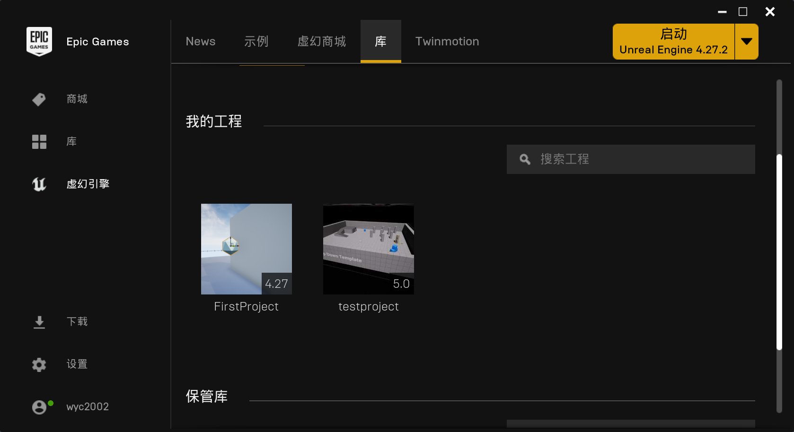
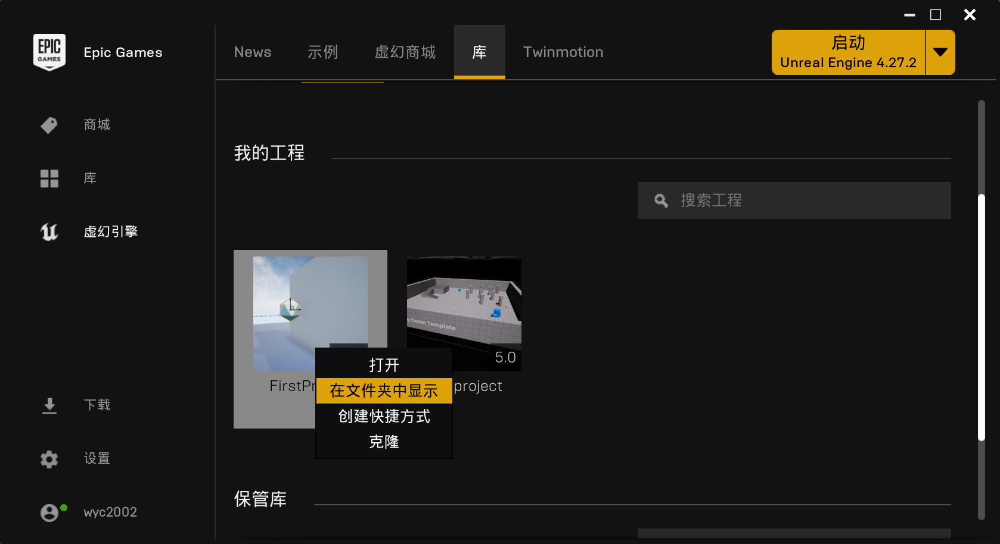
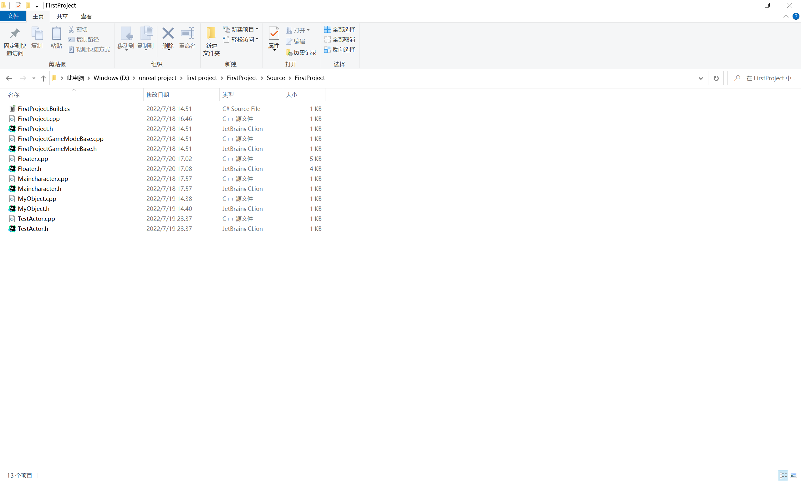
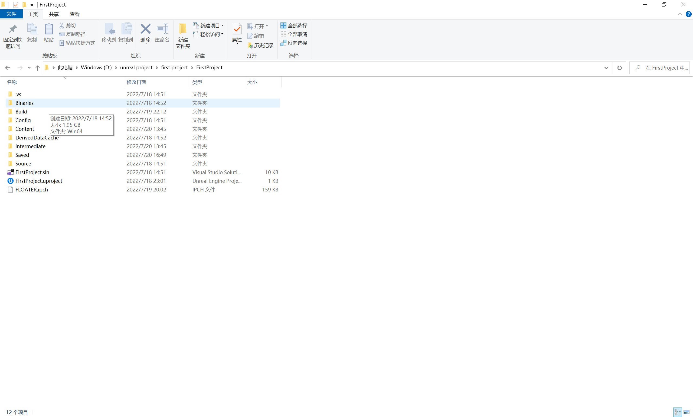
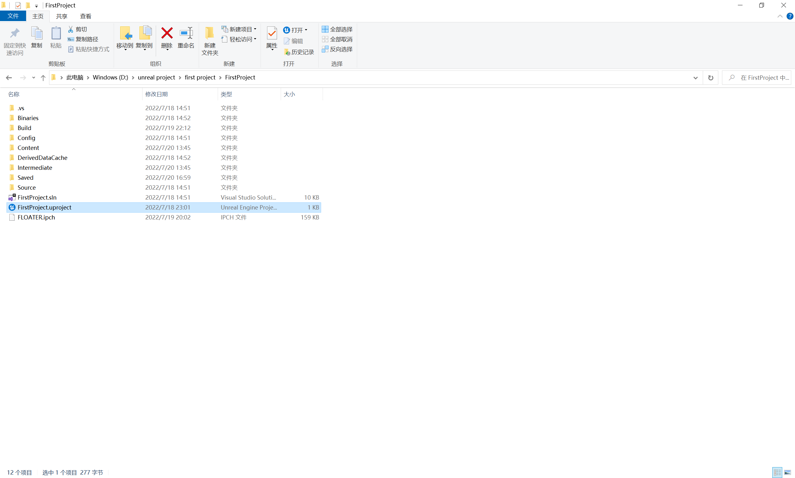

# **删除C++类**

这个操作当然在我学习的过程中基本不会用到，或者每一章学习完之后我会删除这个东西，删除的过程如下

1.进入EPIC

2.右键需要删除的类所在的项目->在文件夹中显示

3.在文件夹下点击Source然后找到我们需要删除的C++类的.cpp文件和.h文件，然后删除

4.回到项目的根目录，删除Binaries文件夹

5.右键UE标志->Generate Visual Studio Project Files

6.重新打开项目会弹出窗口，点击OK就可以了，然后就可以正常打开项目了。

注：删除蓝图类直接点击之后删除就可以了，同时上述操作要在VS和UE都是关闭状态的情况下执行
