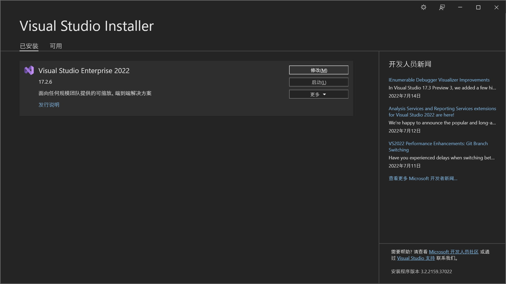
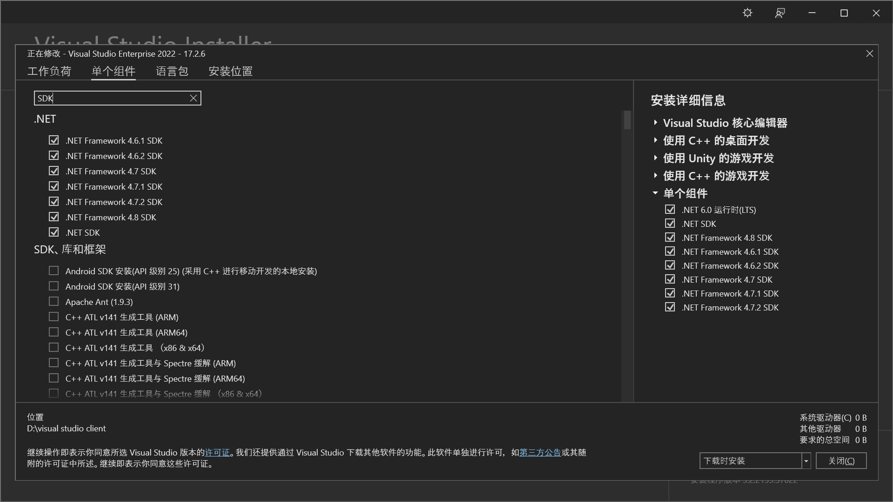

安装中的具体流程

在这个过程中遇到了很多的问题，更新.NET，更新各种东西，但是最后发现，只要在Visual Studio Installer中进行更新就行了

一、更新.NET

    打开Visual Studio Installer ->修改

在出现的小窗口内点击单个组件，然后搜索SDK

安装4.6+的.NET Framework SDK即可

二、安装UE5

官网地址（[虚幻引擎5 - Unreal Engine](https://www.unrealengine.com/zh-CN/unreal-engine-5?sessionInvalidated=true)）

跳转打开Epic  Games-> 虚幻引擎-> 库

选择需要的版本进行安装

需要注意的是，你要至少预留下来100G的空间才可以安装UE4或者UE5

安装完成之后你只需要启动之后，什么都解决了。
